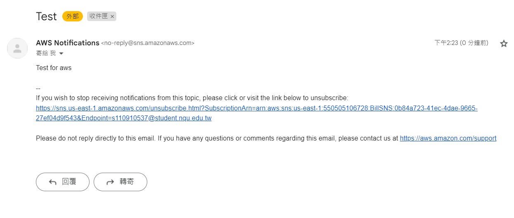
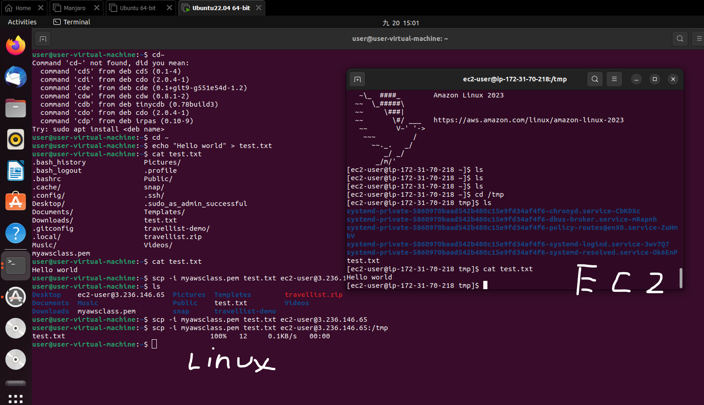
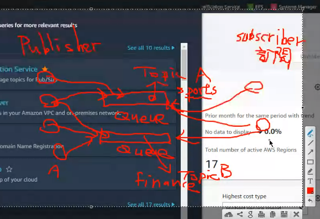
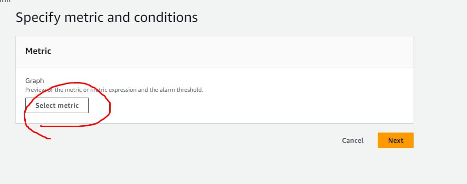

# 02. SNS, CloudWatch, keypair

### Home work






aws 這學期主要說的是aws，基本上成績以筆記為主，期末要交上課的筆記，期中考週會出幾個題目來做測驗，aws很重要但也很多東西要學，希望我們能夠使用英文的介面，因為在職場上面比較多使用的也是英文

Billing Dashboard是否有消費，如果沒有關閉可能會有額外的消費

aws在使用的時候會不會超過預算，導致我的金額暴漲，今天就要教如何隨時地觀察我們的帳單，當超過一定的金額的時候就會發送郵件給我們。

那他如何監控我們的帳單呢??主要是透過他提供的BIILING功能，並且連接到我們的專案，使用者可以訂閱這個專案，當超過額度他就會通知。

### SNS

### Simple Notification Service

建立在Pub 跟 Sub

同步A跟B說B馬上回應

A跟B說但B要過一陣子才會回應你:非同步 Queue與Topic

自動分流?? 每個queue會對應不同的主題 



### 帳單監控

#### 新版:

<figure><figcaption></figcaption></figure>

<figure><figcaption></figcaption></figure>

<figure><figcaption></figcaption></figure>

#### 這樣email是不是要自己打...不知道有沒有template可以解決這個問題

#### 原始教學

等一下我們要監控系統的帳單，系統地出發會有一個訂閱，事件出發了會發送到我們的信箱，帳單會連接到我們的email信箱， 這很重要，為了荷包而努力!!

#### 製作流程

<figure><figcaption></figcaption></figure>

先來創建對應的TOPIC 有FIFO與Standard 誰先進來就先傳甚麼(可能要錢) Standard就是普通模式，他不保證先傳進來的會先發送

我們這邊選擇standard Name: BillSNS&#x20;

<figure><figcaption></figcaption></figure>

<figure><figcaption></figcaption></figure>

<figure><figcaption></figcaption></figure>

<figure><figcaption></figcaption></figure>

對於這個主題至少要有一個訂閱者&#x20;

<figure><figcaption></figcaption></figure>

使用哪種方法來進行通訊?? Protocol:

EndPoint寫上email信箱&#x20;

<figure><figcaption></figcaption></figure>

基本上SNS已經設定完了

publish message

subject: Testbillsns(隨便填) 內容也隨便填

在這裡就可以看到收到了email Pending confirmation 還沒有確認

重新整理之後就可以看到這個Subscription已經Confirm了

當有甚麼事件發生就會把事件丟到什麼樣的主題

抓Email的圖

Service後面有星星，但下去就可以加入到標籤欄

監控很重要CPU 還是記憶體不夠都可以進行監控， 當指標不達標的時候他都能通知，從而進行協助

### CloudWatch

到DashBoards這裡 alarms -> Billing Create alarms 選擇 

metrics 裡面有Billing的指標 amazon在很多地方都有提供服務 老師常用的是N.virginia 在亞洲可以選擇singapore Seoul Osaka 但選擇區域還有其他因素的考量 有些國家不提供某些服務，所以老師用預設的也就是 N.virginia 以後建置的時候就建置在那邊，給帳單的時候都會以region為基礎

Billing -> Total Estimated Charge 打勾就可以根據USD 來當作監控的指標 select matrics

客製化 可以設定最大值 最小值 平均值 一小時 六小時之內

這邊有畫圖給你看，紅色線是我們設定的標準 conditions就是我們的條件

select an existing sns topic

下面這些都可以不用動

接者選擇Alarm name (看得懂就好) 信件的主題(內容)可以自己編輯

最後會給你簡單的看一下 確定沒有問題之後就可以create alarm

剛開始的時候他會出現這個訊息(就是State沒有顯示OK)因為它要量測一個小時之後才會給你結果

cloudWatch + sns發送訊息 老師說如果沒有billing選項的話就選擇N.virginia

IAM的這個功能是Global的 但SNS有區域性的

如果你在美國或者是亞洲都有的話，那就都要設定。

上週在創建虛擬機的時候有很多細節沒有講到 雲端裡面最重要的三個部分有: EC2: Elastic cloud compute 創造虛擬機出來，不同的應用可能需要不同的機器 就像是雲端計算，設備根據你的需求來進行選擇 注意事項: Instances跟 elastic ips在不用的時候一定要關閉不然會收到鉅款!!!

Amazon一年提供給你 720個小時，超過就多收，但是經過剛剛設定就可以大概率的避免超收的現象發生

Instance Lanch an instance 給一個名字 Name and tags 老師取DemoServer

選擇一個鏡像 我們常選的是aws或ubuntu 在課堂當中選擇amazon的linux 接者選擇我們的機器

amazon的版本選擇預測的 學雲端的話要去了解專有名詞，這樣才比較容易去跟他們交流 AMI 就是 AMAZON MACHINE IMAGE 挑選Free tier eligible 就不用花到錢了

選擇架構我們選64位元的架構 在學校學很小家子氣，但在業界就需要比較高級一點的

Instance type 選擇硬體 t代表類型 後面的單字代表它的類型 針對每一個地方詳解這樣學生才能夠了解到它的作用是甚麼

它會告訴你每個小時大概需要花費多少錢 r是代表記憶體導向 c開頭是cpu導向的 m是memory導向

我們使用的是t2.micro

key pair 讓你透過Linux連接到雲端 你可以創建一個 key pair 之後選擇pair type

選擇pem

我們把金鑰放到桌面上 登入的時候都幾乎是採用key的方式來登入而不是帳號密碼

接下來就是網路 Networ setting

VPC 虛擬的雲端中心 可以在裡面產生很多網路，有些網路 預設值是default (一開始就會配置給你了) 老師這邊是172.31.0.0/16 剛開始也有給你一個subnet

Zone aws想要在金門創建雲端中心 那麼金沙 金城 金湖 金寧都可能會有data senter 用此種方法來避免風險，有可能金沙代表zone a 金城代表zone b以此類推 vpc是一個網路中心我們想要建構一個網路

172.31.1.0/24對應zone a 172.31.2.0/24對應zone b

下禮拜會講解VPC要怎麼創建 有了VPC就要選擇Subnet 有了Subnet就要選擇動硬的Zone

Internet gateway 的縮寫是igw 它的目的是讓私有的雲端連接到我們的雲端上面 預設的subnet可以連接，但是自己建立的要自行設定，否則不能夠連接

lay 1 vpc lay 2 subnet lay 3 zone

Auto-assign public ip 自動配置ip我們選擇Enable

我們的虛擬機還沒有建構完成，現在看到firewall的部分， 在aws關於安全有兩個部分 第一個部分為 acl -> vpc security group -> VM

控制甚麼東西可以流進來是以acl來控制的 甚麼東西可以進入到VM當中是以security group來控制的

你的虛擬機要提供什麼樣的服務就要提供甚麼端口 很多東西你要去了解它為甚麼來，而不是下一步下一步就好了

剛開始的時候我們沒有規則所以就自行創建group sq\_default\_ssh 命名的時候不能夠使用"-"

接者輸入描述 type -> ssh source type -> any where

配置圖:

再新增一個ICMP

下一個部分就是硬體的配置:

右手邊summary的部分就是給你選擇要創建幾台虛擬機

確認完成之後點擊 Lanch instance

Inbound 流進來的流量

Outbound rules 出去的流量

成功創建Security group (老師這邊是先創造Security group再進行選擇)

接下來選擇Security group(剛剛創建的)

ec2 Instances 完成設定intance

當你看到instance state = Running就代表我們創建成功

在你的cmd輸入 instance的ip位置(public ip)如果設定完成的話就可以ping的到

我們想要使用ssh連到我們的amazon虛擬機

這台機器我們怎麼連進去? 選擇Connect (在網頁當中選擇)

我們需要把key pair上傳到機器上面 我們使用winscp將key pair上傳到vm ware上面 (ifconfig可以查看 虛擬機ip)

點擊Login 找到我們的key drag 到 vm當中

我們修改一下這個key的權限，改成400

```
chmod 4-- myawsclass.pem
```

之後就可以使用vmware連接到我們的aws instance

```
ssh -i myawsclass.pem 
```

之後要上傳檔案到雲端上的時候 就可以使用ssh把檔案拷貝到雲端上面

可以看到我們剛剛上傳的檔案

今天就是建立虛擬機 本地端登入 上傳虛擬機

subnet
