# 04. billing, NatGATEWAY, igw, mariadb

billing帳單

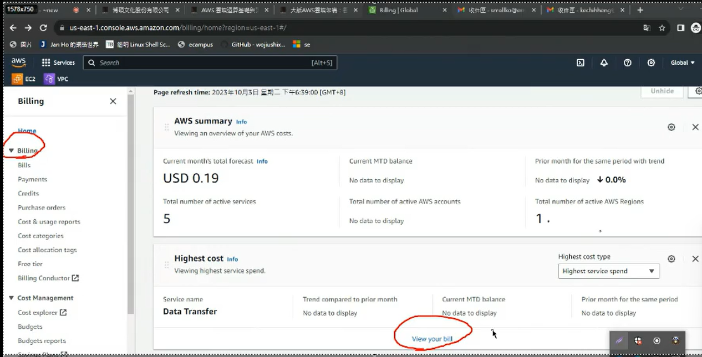

View your bill 有些銀行會通知你有海外的消費 如果想要看歷史的帳單

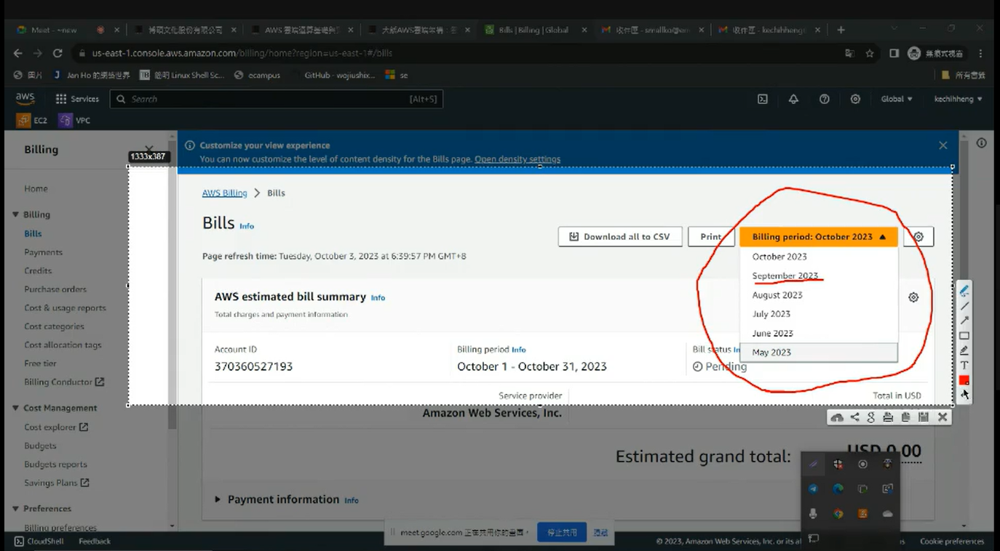

最常看到的就是Elatic computer cloud這個就是EC2 他還可以看到詳細的看到你使用的伺服器的位置

這邊是Elastic IP address

創造出來的VM如果想要綁訂一個固定的對外IP 可以去申請一個Elastic IP address 這樣不管你的虛擬機開機幾次重新開機的時候你ˇ的IP仍然不會改變

虛擬機STOP再重新Start你的IP就會改變，如果你需要商業服務可能就需要一個固定的IP

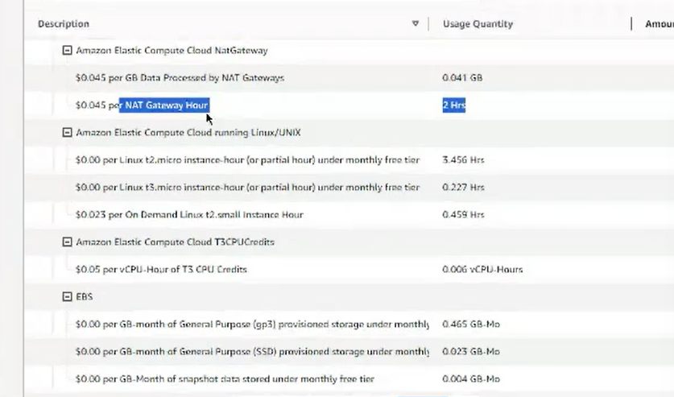

老師的帳單

今天要用的是NAT GateWay也有可能會花到錢

有些服務在使用的時候需要花一些錢

今天要推薦兩本書，是最近才剛上市的

第一本&#x20;

<figure><figcaption></figcaption></figure>

他會去介紹概念，並且用圖形化的方式來把他展現出來

另外這本書有教實作的部分&#x20;

<figure>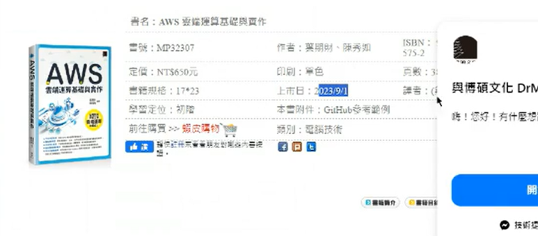<figcaption></figcaption></figure>

今天要繼續完成上禮拜講的內容

虛擬的雲端中心，並且在裡面建立了公開的網路與私有的網路，為了要讓公開的網路可以上internet 所以需要 internet gate way

我們今天要做:

虛擬機放在Poublic Network就需要給一個IP給他

Vm in public直接允許他有一個publicIP(預設的時候是關閉的)

等一下還要創建一台私有的虛擬機，看他可不可以跟公有虛擬機溝通

如果剛開始私有虛擬機需要連往來下載一些套件，那就必須暫時開啟網路連線讓他可以下載一些套件 我們想要安裝mariaDB

公有網路則是想要安裝php&#x20;

<figure>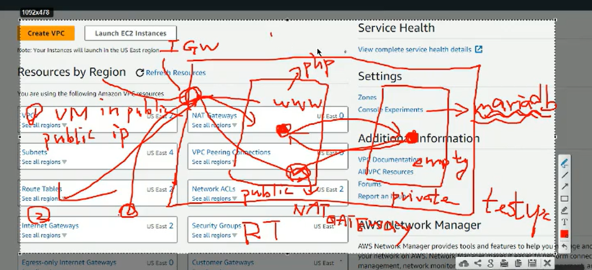<figcaption></figcaption></figure>

Apache php mysql <-今天要做的事

首先先選VPC，選擇subnet再選上個禮拜的textvpcPublic會有一個選項auto-asign customer owned IPV4 address 他預設是NO

如果要自動讓創建的虛擬機有對應的IP就要把它變成YES

於是我們就要來編輯&#x20;

<figure>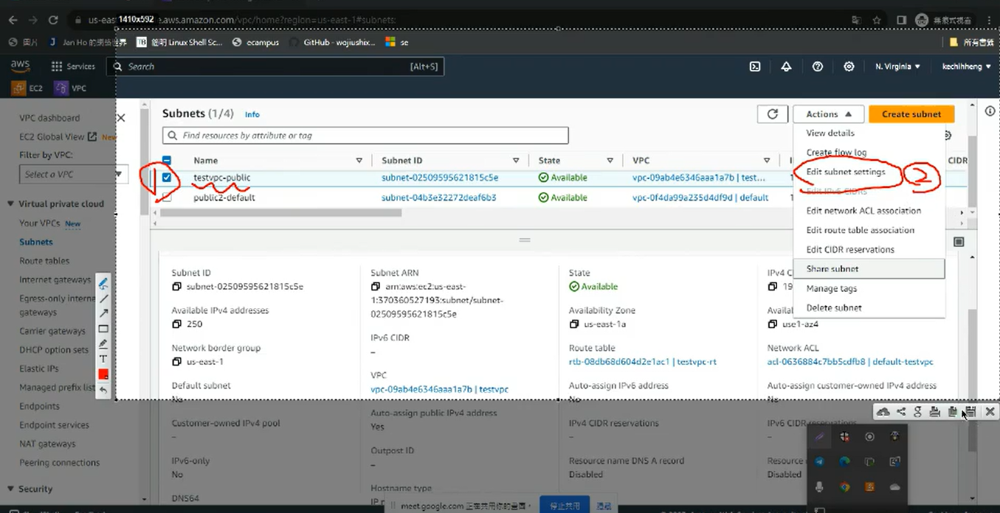<figcaption></figcaption></figure>

打勾Enable auto-assign .....

<figure>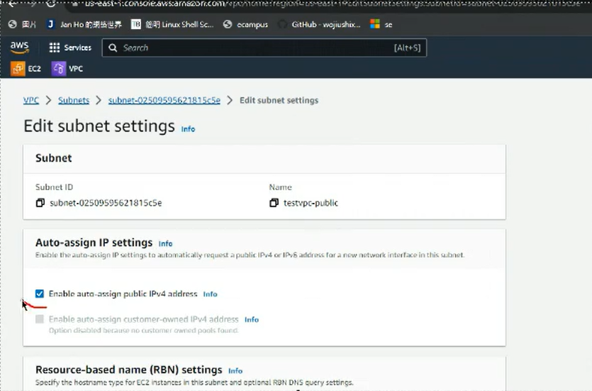<figcaption></figcaption></figure>

Save

好像我們要的功能在這裡&#x20;

<figure>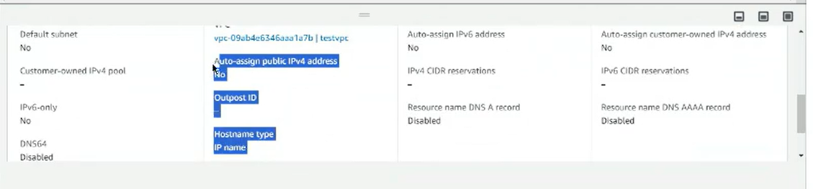<figcaption></figcaption></figure>

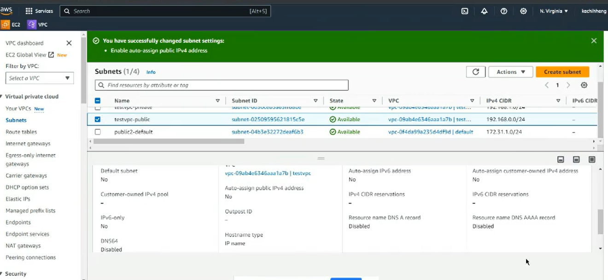

編輯一下把剛剛的Enable打勾就可以看到變yes

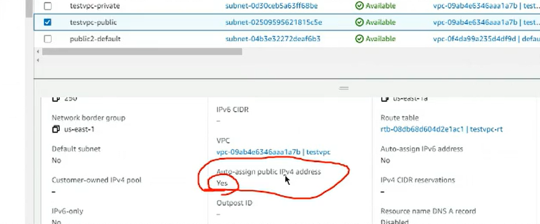

之後我們要建立instance他就可以預設auto -assign public IP

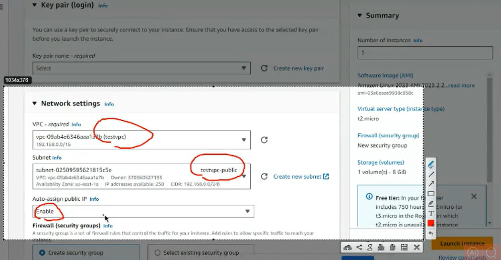

他就會自動配置公有IP給你創建的虛擬機 今天要做的事情就是把上個禮拜建立的虛擬機開機

如果忘記怎麼建:&#x20;

<figure>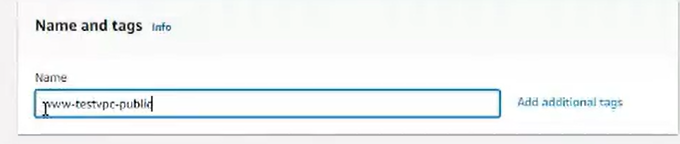<figcaption></figcaption></figure>

使用 amazon t2.micro 設定keypair

testvpc testvpc.public (Subnet)&#x20;

<figure>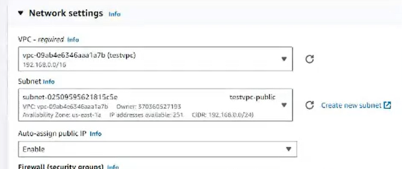<figcaption></figcaption></figure>

選擇group

sg\_testvpc\_ssh\_http

還需要放上user data&#x20;

<figure>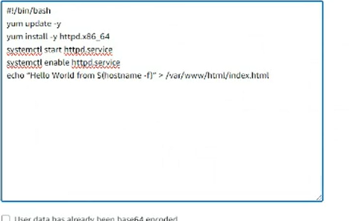<figcaption></figcaption></figure>

```
#!/bin/bash
yum update -y
yum install -y httpd.x86_64
systemctl start httpd.service
systemctl enable httpd.service
echo “Hello World from $(hostname -f)” > /var/www/html/index.html

```

接者就launch

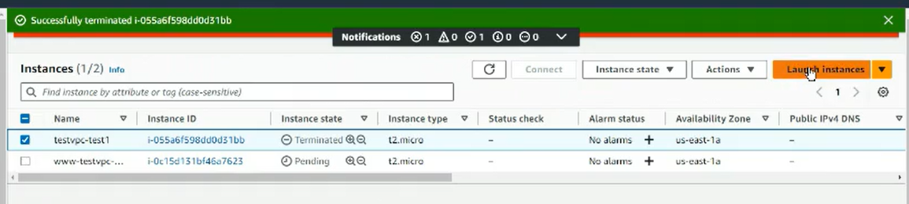

Name: db-testvpc-private&#x20;

<figure>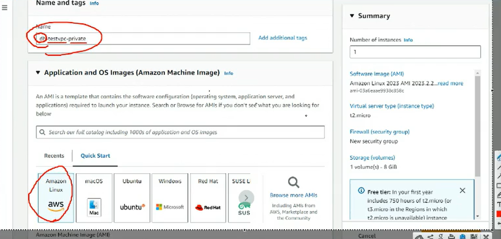<figcaption></figcaption></figure>

接者設定key pair Network settings


auto-assign public IP 設定disable 因為這是資料庫虛擬機

建立security group 我們取一個名子&#x20;

<figure>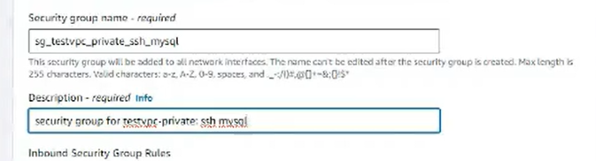<figcaption></figcaption></figure>

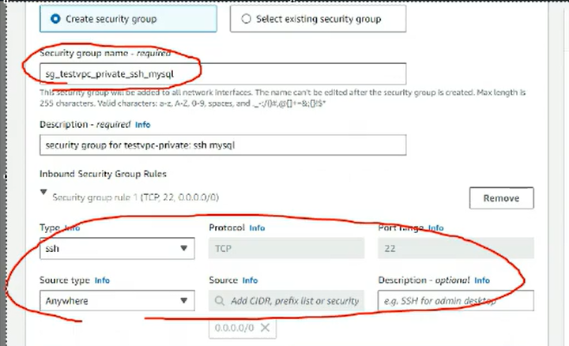

再新增一個規則 MySQL/aurora&#x20;

<figure>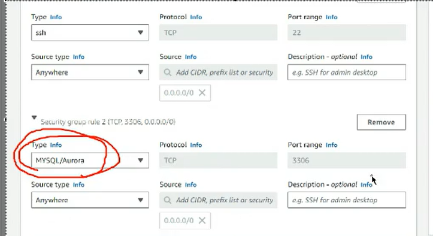<figcaption></figcaption></figure>

\
用預設的8g記憶體

<figure>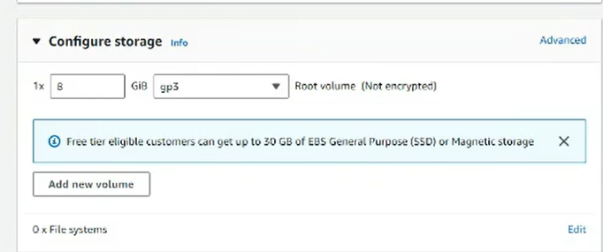<figcaption></figcaption></figure>

接者launch

回到instance&#x20;

<figure>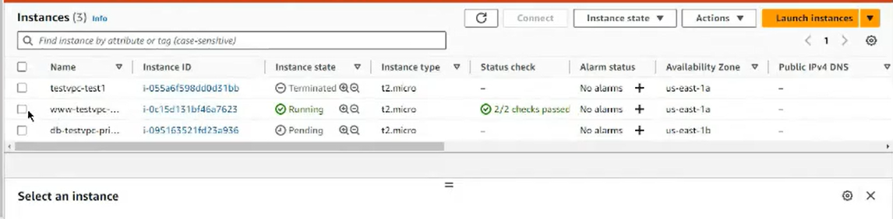<figcaption></figcaption></figure>

我們就建立好了兩台虛擬機

記住public的網址&#x20;

<figure>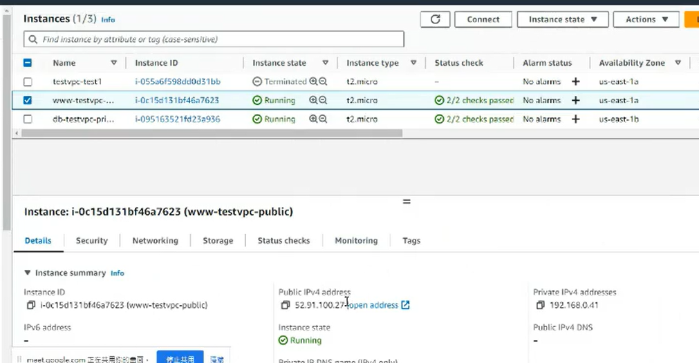<figcaption></figcaption></figure>

透過本地vmware連上去&#x20;

<figure>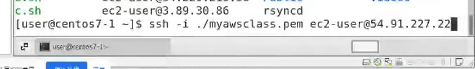<figcaption></figcaption></figure>

再開一個終端 把key pair傳送到那台虛擬機上面

查看他的ip

把自己的key pair 上傳到www 的vm上&#x20;

<figure>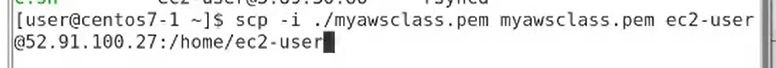<figcaption></figcaption></figure>

上傳到ec2的虛擬機(再開一台的)上面

private的ip是 192.168.1.40&#x20;

<figure>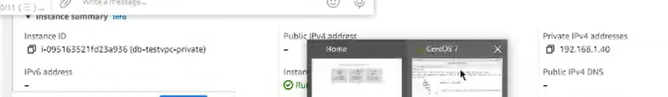<figcaption></figcaption></figure>

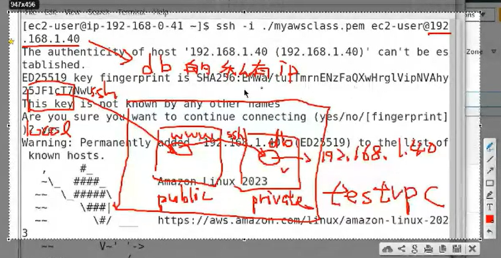

使用ssh連接到public的虛擬機，再透過public虛擬機連接到private也就是存放db的虛擬機

### 抓一下圖

一台虛擬機是再public裡面另一台連接到private

內網的虛擬機要ping 外網是沒有辦法的

查看路由表

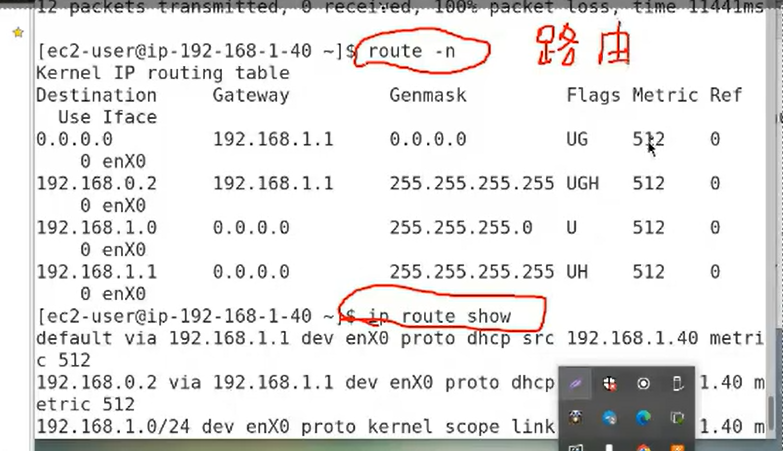

```
route -n
```

今天我ping 8.8.8.8他就會去路由表當中 一一比對看可以跟誰比對成功

如果都不符合那就會丟給192.168.1.1但她也是在內網，所以就沒有辦法連接到internet上&#x20;

<figure>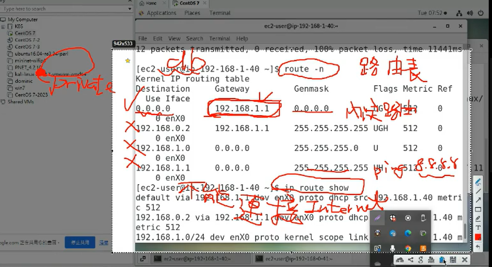<figcaption></figcaption></figure>

如果要連接到internet上面等一下要在public上面建立一個NatGATEWAY 跟igw連接再一起，到時候我們在ping8.8.8.8的時候，就會傳輸到natgateway,natgateway就會把資料傳輸給igw從而連接到外網上面

找到VPC -> NATGATEWAY&#x20;

<figure>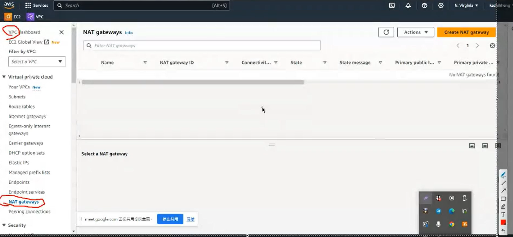<figcaption></figcaption></figure>

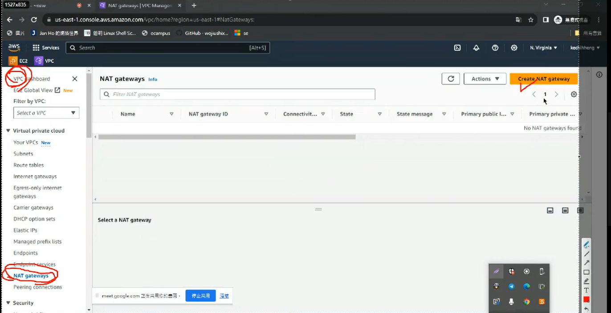

取名字&#x20;

<figure>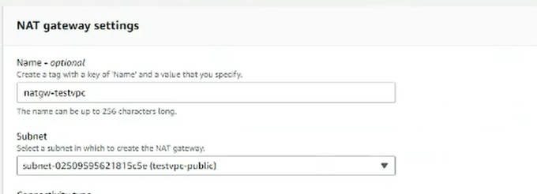<figcaption></figcaption></figure>

名字叫做NATGW-TESTVPC

Subnet則是問你要放在哪裡，我們必須要放在public這個位置

因為要讓內網的人連接到外網所以下方這個按鈕要選擇public

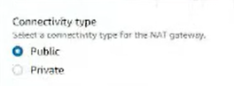

我們要給他一個ip位置，這邊我們選擇&#x20;

<figure>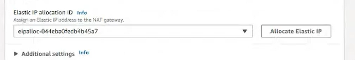<figcaption></figcaption></figure>

Allocate Elastic IP 就可以了 沒有Elastic ip nat就沒有辦法連接到外網上面，不過要花錢

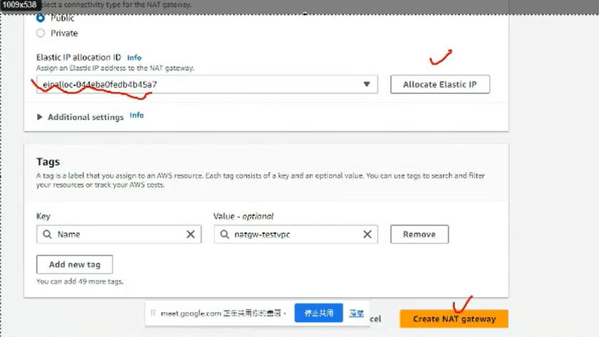

但現在學總比以後學好

我們看到Natgate way，他已經產生出來了&#x20;

<figure>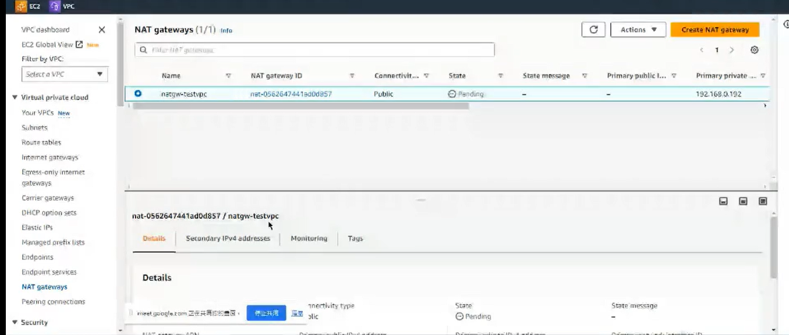<figcaption></figcaption></figure>

做完之後還是不能連接到internet上 我們還需要創建路由表 到route tables&#x20;

<figure>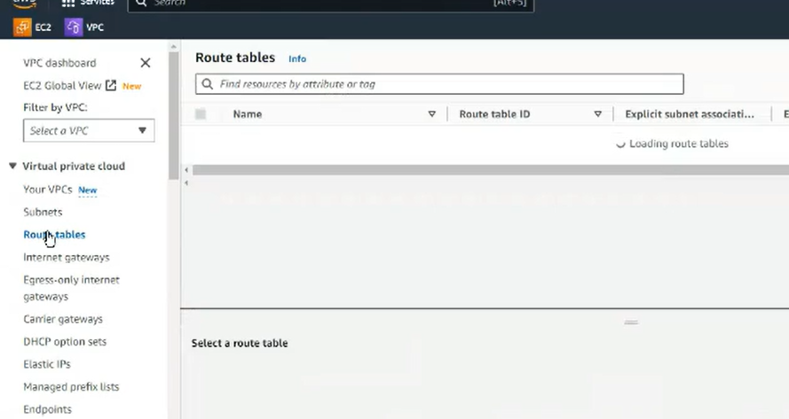<figcaption></figcaption></figure>

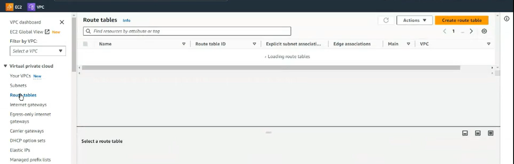

點擊create route table&#x20;

<figure><figcaption></figcaption></figure>

給他名稱跟選擇vpc 之後選擇黃色創建按鈕

接下來我們來編輯一下route&#x20;

<figure>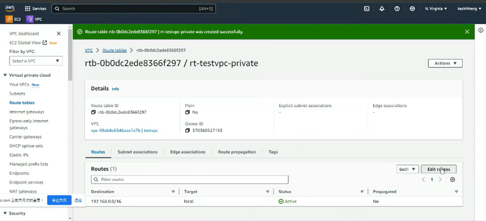<figcaption></figcaption></figure>

我們現在應該在rt-testvpc-private下面

理論很重要實務也很重要，有理論沒有實際創建經驗就無法把理論變現實。


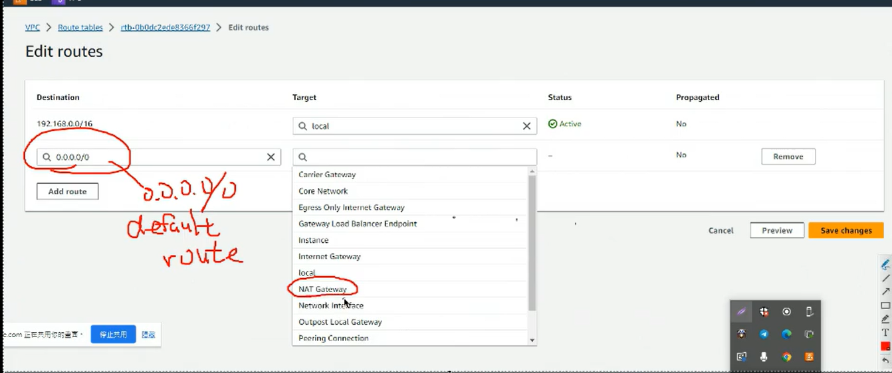

\
選擇 NatGATEWAY

<figure><figcaption></figcaption></figure>

按下SAVE

回到虛擬機

很久沒有連線就會跟雲端虛擬機斷線所以先重新連回到雲端

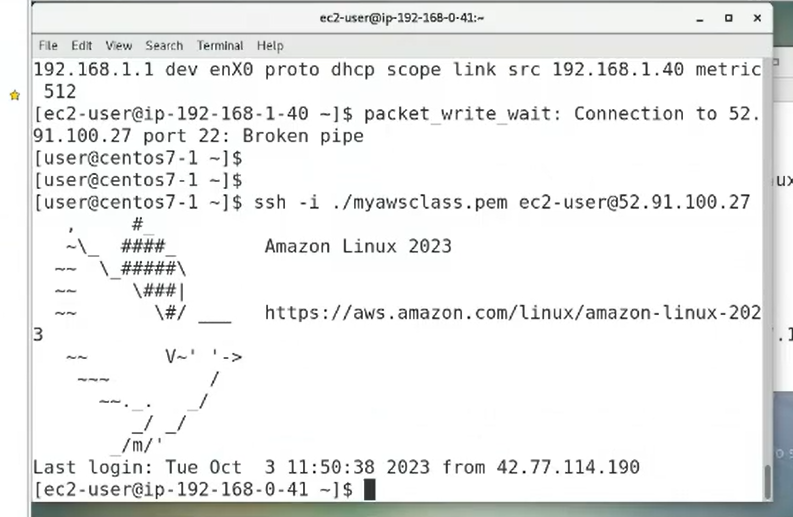

再連線到DB

在這之前我們還需要把路由表套用到內部網路

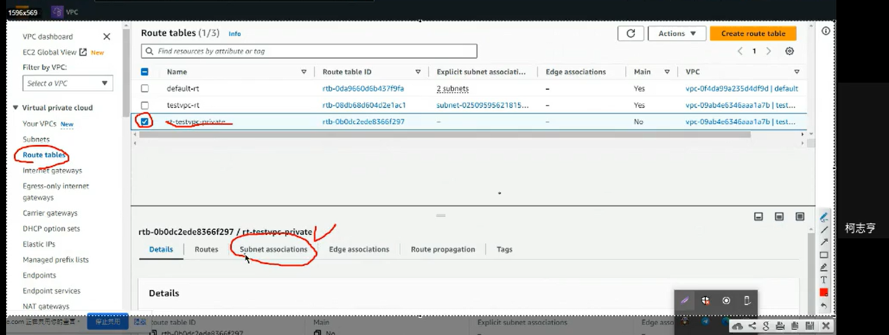

做一下編輯&#x20;

<figure>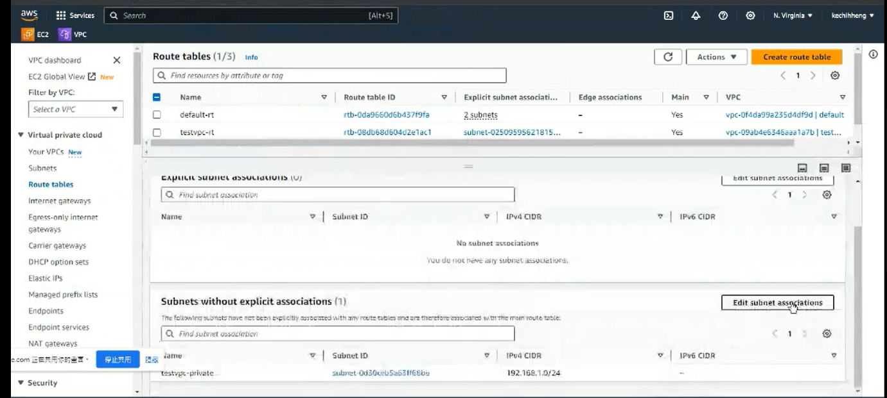<figcaption></figcaption></figure>

把PRIVATE打勾&#x20;

<figure>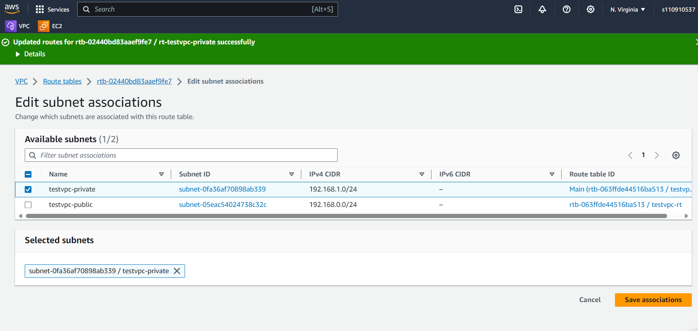<figcaption></figcaption></figure>

代表我們要路由表連接到這個位置

接下來打開虛擬機 連接到PUBLIC再連接到DB

可以看到DB已經可以連接到外部網路了&#x20;

<figure>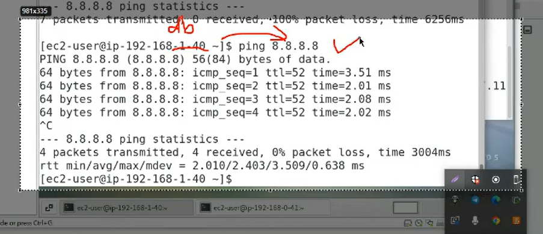<figcaption></figcaption></figure>

所以現在我們的DB已經可以去下載軟體進行更新

現在軟體要進行更新 \
(在PRIVATE 虛擬機輸入)

<figure>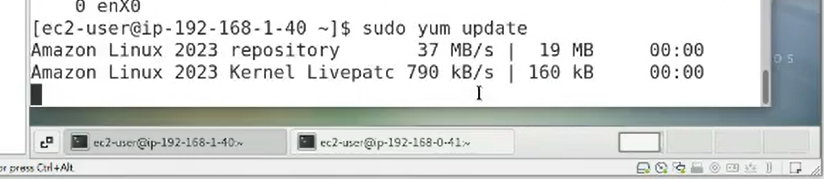<figcaption></figcaption></figure>

```
sudo yum update
```

接下來我們要裝MARIADB

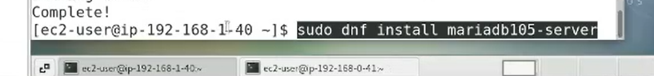

```
sudo dnf install mariadb105-server
```

讓我們把資料庫裝起來

裝完了之後我們要啟動資料庫

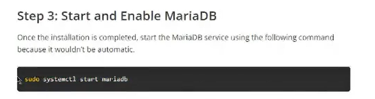

```
sudo systemctl start mariadb
```

自動啟動 (ENABLE)&#x20;

<figure>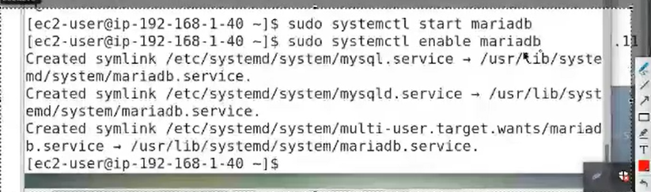<figcaption></figcaption></figure>

```
sudo systemctl enable mariadb
```

查詢資料庫&#x20;

<figure>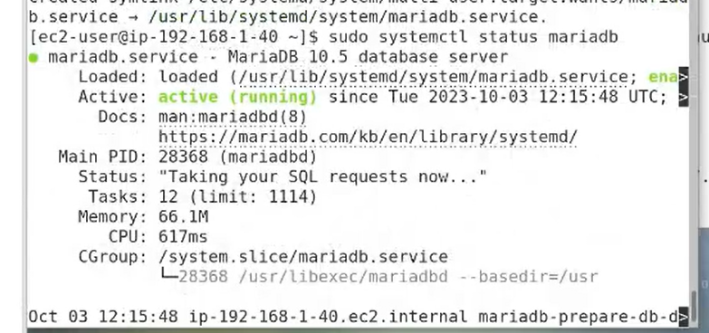<figcaption></figcaption></figure>

現在NATGATEWAY已經可以關掉了

接下來我們要做資料庫的設定&#x20;

<figure>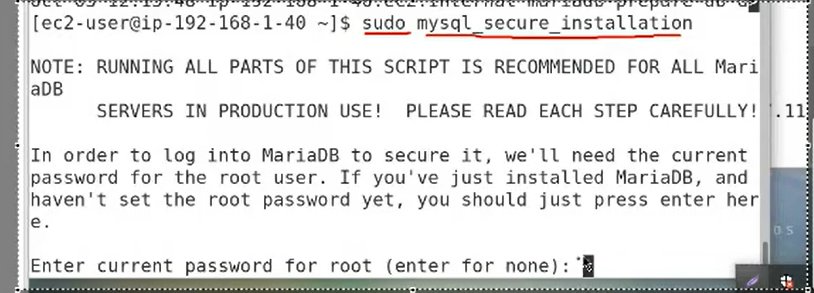<figcaption></figcaption></figure>

```
sudo mysql_secure_installation
```


我們按下ENTER


選擇NO

改變密碼&#x20;

<figure><figcaption></figcaption></figure>

我們設置123456 確認密碼再輸入一次


SUCCESS 移除匿名使用者&#x20;

<figure><figcaption></figcaption></figure>

選擇Y


移除測試的資料庫&#x20;

<figure><figcaption></figcaption></figure>


成功設定MARIADB

登入:&#x20;

<figure><figcaption></figcaption></figure>

```
mysql -u root -p
```

密碼是123456&#x20;

<figure><figcaption></figcaption></figure>

MARIADB已經安裝成功

### 抓一下圖

NATGATEWAY要怎麼關??


來到VPC NATGATEWAY

選擇我們的NAT GATEWAY -> ACTION DELETE NAT GATEWAY&#x20;

<figure><figcaption></figcaption></figure>


順便回到我們的路由表&#x20;

<figure><figcaption></figcaption></figure>

也刪掉

可能會出現這樣的錯誤&#x20;

<figure><figcaption></figcaption></figure>

這是因為我們還有關連到一些物件所以我們要取消連結


取消打勾&#x20;

<figure><figcaption></figcaption></figure>


好了接下來可以刪了

當然你刪掉NAT GATEWAY後，就沒有辦法連接到外部網路了&#x20;

<figure><figcaption></figcaption></figure>

```
mysql -u root -p -h 192.168.1.40
```

花最多錢的是申請DOMAIN NAME的時候

我們想要新增一個使用者

希望可以透過PHP讀取資料 這樣就必須設定一個使用者&#x20;

<figure><figcaption></figcaption></figure>

帳號密碼都是USER

CREATE USER:&#x20;

<figure><figcaption></figcaption></figure>


```
CREATE USER user@`%` IDENTIFIED BY 'user';
```


授權user所有權限:&#x20;

<figure><figcaption></figcaption></figure>

```
GRANT ALL PRIVILEGES ON * . * TO 'user'@'%';
```

更新權限&#x20;

<figure><figcaption></figcaption></figure>

```
FLUSH PRIVILEGES;
```

這樣我們就創建了一個使用者

測試這個使用者是否可以遠端登入

在www機器上面安裝mariadb105 這是個客戶端的工具&#x20;

<figure><figcaption></figcaption></figure>

```
sudo yum install mariadb105
```

ubuntu 可以使用 `dnf install`

裝完了之後我們怎麼測試?&#x20;

<figure><figcaption></figcaption></figure>

密碼我們剛剛設置user

連接到1.40這台db虛擬機 上面的畫面就是連接成功

### 抓一張圖??

注意要遠端登入而不是本地登入，怎麼判斷遠端登入呢??就是看ip,ip不一樣就是遠端登入&#x20;

<figure><figcaption></figcaption></figure>

完成資料庫安裝之後Nat一定要刪掉 elastic ips的ip會在關閉兩台虛擬機之後消失

Instance stop就好不要terminate,不然所有資料庫又會不見&#x20;

<figure><figcaption></figcaption></figure>

Elastic IP address&#x20;

<figure><figcaption></figcaption></figure>

點進去 把它release&#x20;

<figure><figcaption></figcaption></figure>
