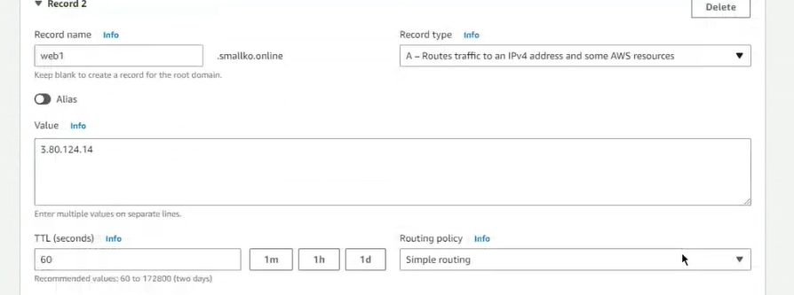
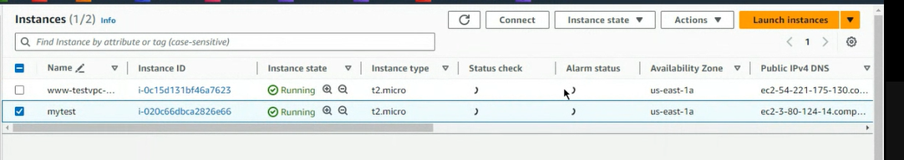
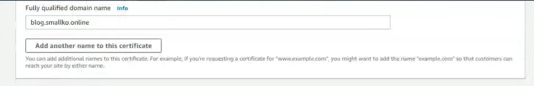

# Route53 & CDN

今天要說的是Route53 他每個月會收取一定的費用 所以一旦開啟了就需要付費

我們先開啟www的機器


複製他的ip位置


輸入http://`ip位置`可以進行訪問

接著來到route53的位置 點選上次創造的test.`你的網域`


> 右上角有一個Edit Record可以進行編輯

接者把我們EC2 的IP貼上 


之後按下Save

接下來就可以使用Domain name的方式來進行存取


你要連上 domainname的那個網址要使用無痕瀏覽，不然瀏覽器會把你擋掉(後來測試是不是真的要等一下子....又好像會擋)

## 把這個部分做出來，貼一張圖

後面我們會說怎麼架設一個https的網站

我們現在要增加一個新的紀錄


這次我們使用test2 Record type我們選擇CNmae 

* A:前面DomainName後面放ipv4的位置
* CNmae: 後面放另一個網址 

> 兩個網址都可以導向同一個網站

如果我們有www.a.com但是想要讓別人輸入ftp.a.com也可以連進來我們的網址，那麼我們就可以創建一個新的record名稱叫做:ftp.a.com 接著選擇CNAME 在value的位置填上 www.a.com 就可以把ftp.a.com導向www.a.com了


> 我們給他 test 這個domainName TTL 設置為120

我們輸入www.a.com給瀏覽器去進行查詢，瀏覽器會去調取DNS的紀錄，查看對應的IP位置是多少，接著把這個IP位置傳回給我們的機器，接著我們的機器就會把這個IP位置對應www.a.com，並且儲存到一個檔案當中。之後就可以直接根據這個紀錄來進行導向。

上面說的是一個快取，我們的記錄檔是一個快取，他是有時間限制的，而這個快取要放多久是根據TTL來決定的。

如果你密集的去查詢，route53就會多收你的錢，當你商業使用的時候，就會有很多用量，就會導致你的花費會變得更高


之後就可以輸入http://`你的record(test2)位置`

`http://test2.wangedu.online`

來連接我們的網站

## 再貼一張圖

如果你的網站會常常變化，TTL 最好不要讓她久久更新一次，因為IP位置會一直變化，你的快取就會沒有記錄到新的IP位置

接下來要使用的是`dig`


再create record 

_Alias是AWS特有的功能_預設的情況下他是關閉的

subdomain這邊不可以是空的，對於alias來說，他可以直接使用你註冊好的domainName，那麼subdomain這個位置就可以是空的。

我們再開啟一台機器，到ec2創建一台機器


Advance Detail 

User Data:

```shell
#!/bin/bash
yum update -y
yum install -y httpd.x86_64
systemctl start httpd.service
systemctl enable httpd.service
echo “Hello World from $(hostname -f)” > /var/www/html/index.html
```

Create

回到route53 創建一個新的 record 

> 名稱叫做web value值為剛剛創建的instance的值


接著可以再開啟一筆record (在同一個頁面不用再重新創造) 名稱叫做web1， value值填上他的ip位置



我們之前使用s3來製作一個靜態網站，但是他的domainName並不是我們想要的，今天想要使用我們的DomainName

到s3 create bucket 取名子的時候要留意，跟你想要的domainName要一致 


\-> create bucket

到Permission Edit bucket policy

```
{
    "Version": "2012-10-17",
    "Statement": [
        {
            "Sid": "PublicReadGetObject",
            "Effect": "Allow",
            "Principal": "*",
            "Action": "s3:GetObject",
            "Resource": "arn:aws:s3:::blog.smallko.online/*" <-要做更改，改成自己的s3 (arn)
        }
    ]
}
```

修改一下Policy

回到bucket裡面，上傳一個網頁

創建一個index.html並編輯，最後丟到bucket裡面> Upload

之後到Web Hosting 

Enable 

> 指名index.html 後save cahnges

把webHosting的網址打開可以看到我們的網站，但這並不是我們想要的結果，並不能跟我們的網址進行結合

所以現在我們需要create record recordName要跟 bucket的那個剛開始的名稱一樣


> 我們bucket的名稱是 blog. .......

之後alias要打開 選擇S3 US East 


create record


> 成功綁定我們網域的名稱

## 做一下這個貼一張圖，aws跟自己的domainname都可以連接到instance

如果你希望輸入http://`你的domain` <-- root Domain

root Domain就是前面沒有前綴

於是我們再創建一個新的bucket


> bucket Name直接輸入你的domain


建立bucket

接著開放權限

```
{
    "Version": "2012-10-17",
    "Statement": [
        {
            "Sid": "PublicReadGetObject",
            "Effect": "Allow",
            "Principal": "*",
            "Action": "s3:GetObject",
            "Resource": "arn:aws:s3:::blog.smallko.online/*" <-要做更改，改成自己的s3 (arn)
        }
    ]
}
```

上船一個基本的網頁

編輯剛剛的index.html 

再加上一點內容，接著上傳到bucket 

編輯website hosting


> 把這個網址貼到瀏覽器上面

新增一個record

把Alias打開就可以不寫recordName 


Alias可以讓你直接使用domainName就可以進入到你的網站。

## 貼一張root Domain成功的圖片

Alias也可以使用在負載均衡器 

使用Alias就會讓別人不知道你的網站放在甚麼樣託管的平台，間接的增加了安全性

DNS 也可以用來製作簡單的負載均衡器

可以設定幾%的流量會到哪台instance，這樣就可以不用負載均衡器來實現(使用DNS)

Ok.來實現這個功能:

再到route53創建一個新的record叫做:"weighted"

Value這邊則輸入instance的ip address


有一個選項是Geolocation 根據你在的位置分配到哪個伺服器

**Latency**: 根據人與伺服器之間的延遲來做出回應


> s1,s2,s3 are servers

**failover**: If your server is dead it well provide another server


自己的權重與全部權重總和的比值


老師是直接到route53新增一個record


> 名稱要一樣


> ip位置是另一台instance


$$
Weight = \frac {100} {100+100}
$$

 相同的名稱卻得到不同的instance ip 代表我們成功創造

等等要說的是CDN 

根據你的位置來判斷由哪個伺服器提供給你內容

一各CDN可能就是。在全球的網路上面有很多個節點，哪這些節點有可能會自動的去別的伺服器吧？當前節點沒有的資料下載下來，當這個區域的使用者想要連接到我們的節點的時候，他就可以直接從這個CDN節點去獲取資料而不用到別的是否去去去取得資料。這樣可以提升速度。而且我們使用者所關注的並不是想要使用哪個伺服器來做連接，我們所想要的事情就是要怎麼樣獲取我們想要的資料。所以資料才是重點。從哪個伺服器獲取並不重要。

那現在我們要使用到的就是AWS的cloudfront功能。接著呢，由於這些instance他已經不太需要去使用了，所以我們就先把它關閉，以免他消耗太多的流量。



 我們先點幾橘色的按鈕來create一個CloudFront的distribution。

首先，他需要你去輸入一個origin。 其實這個origin就是我們剛剛所創建的S3，那你可以到。 S3的這個Bucket網站呢，去看看你到底要選哪個bucket去進行使用。


我們選擇blog的這個Bucket，並且呢到下面去複製他的一個static website Hosting

 前面的HTTP可以先拿掉。


前面這些基本上都可以不用去動它。 

In web application fireworks, we select do not enable security protection.

 In here, we need to sit in the root object, then we. Select the index.HTML.

Okay, we can create this distribution.

It will cost you some time to deploy.


Later, if we want to delete this distribution. we need first to select disable option.(Not now we need processing our works LOL)


### Wait for deploy....

When you deploy successful you will see. 


OK let me copy the dominant and passed in the another page.


 You can say in different ip address had the same content.

> https://whatismyipaddress.com/

Click above IP address you can see your IP address and location.

Okay, now we want to find our CDN address's Origin source.

記得把https://**去掉**


We pasted CDN's IP


We want know whatismyipaddress.com's location


We can copy the address

 Paste and search You can saw location: california


diffent ip address but same location


剛剛用本地端連接到的CDN位置是在Taiwan但是如果我用。買IP address網站。去連結到的CDN位置卻是在加州。這個結果表明，cloud front他已經把我們的IP address部署到全球的每一個CDN上面。而當我們使用虛擬機發起請求的時候，最近的CDN是在臺灣，但是使用is my ipaddress對這個網站的時候。因為它的伺服器是在加州，所以他會找到最近的CDN去做連結。也就是加州這個位置。

## 貼上一張是直接連，一張是cloudFront連接出來的Picture

我們先把CloudFront關掉 

按下Disable 稍等一下，他會Deploy之後才可以刪除

最後要講的是Https的服務

首先，我們需要使用AWS的certificate manager。

他可以保證你網站的機密性跟穩定性。這樣就可以為你的。網站資料提供一個較為安全的。管理渠道。

OK，接下來點擊 Create certificate。


選擇public certificate Next

 放上你想要使用DomainName的名稱。

 使用DNS 驗證

先到 route53 刪除一些剛剛測試用的DomainName


留下這些 

Go back to certificate manager

 We using Dns validation

select RSA encode then click Request button 

如果你不是使用AWS的服務的話，而是使用其他的，像是Google像是微軟提供的這個都mini server，那么你必須要把這一串東西貼到你自己的DNS server。


但是我們使用的是AWS，所以我們就不需要再把這個東西複製貼上到我們的go daddy上面。

點擊你剛剛創造的這個certification。到他的詳細頁，應該會發現這個頁面。那么你會發現有一個create record 點他 


按下Ｃｒｅａｔｅ　ｒｅｃｏｒｄ

再回到Route53 的介面，可以發現他已經自己幫你創建好一個 record


嘿 CloudFront已經可以Delete了 


這個畫面代表證書已經頒發好了??


我們可以設定讓cloudfront獲取這個certification的這個證書。之後就可以讓客戶端能使用https去連接到我們的crowd from，那由於它有一個證書，所以會使已https的方式去進行。哪這個CloudFront會去連接到我們的S3，但是S3它是使用HTTP協議的，所以cloudFront會把這個https協議對接到HTTP協議。最後你只要輸入https，就可以連接到我們的S3。

回到S3 

點擊 blog前綴的這個選項 選擇property

 複製 website hosting

創建CloudFront

貼到cloudFront 

並且刪除http://

跟剛才不一樣的地方是這裡


http redirect to https


這個地方關閉

選擇證書


CloudFront 的 destribution 要加入


route53的DomainName

Create description

等等它部屬，部屬完畢後就可以使用https來做連接

還有一個地方要修改喔!!

### 需要新增 route53 的一個record

到route53 create record 輸入blog

value 是 cloudfront destrubution的 網址


## 貼上一張圖

* s3直連
* cloudfront + 自己的DNS (輸入我們的DomainName)
* cloudFront
