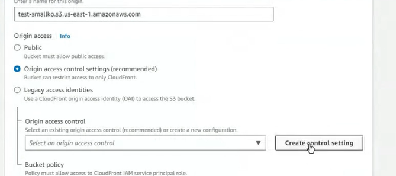
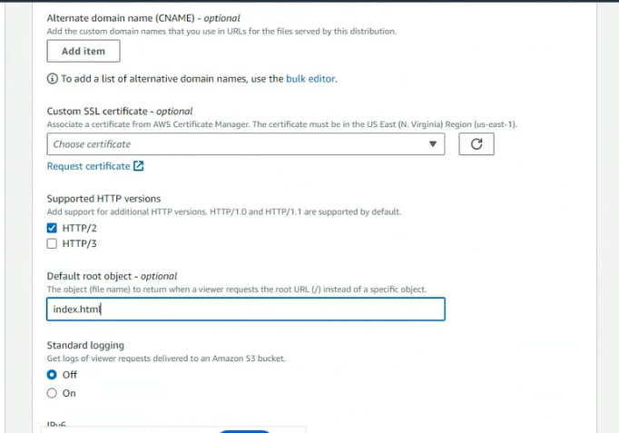
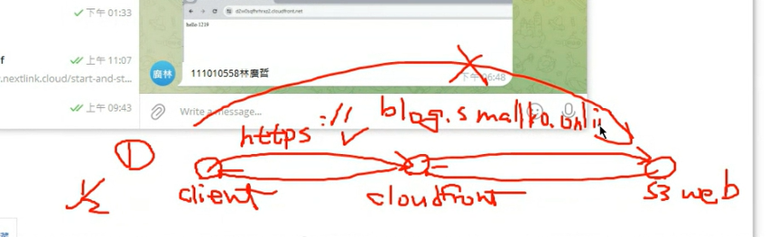
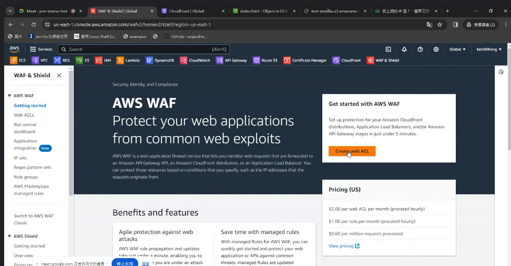
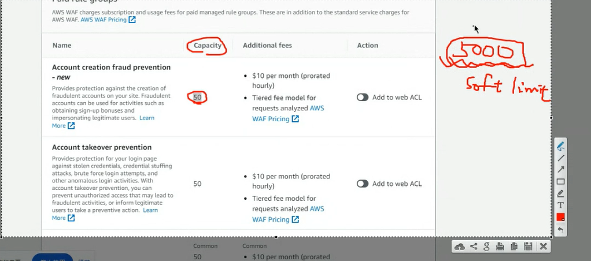
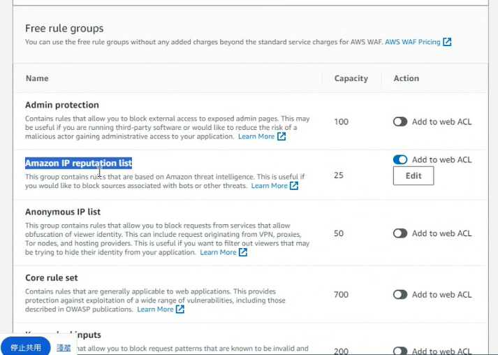
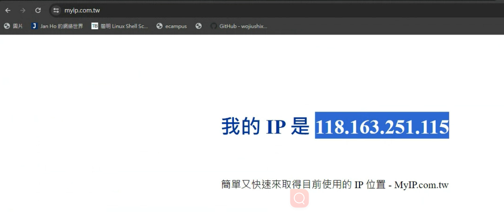
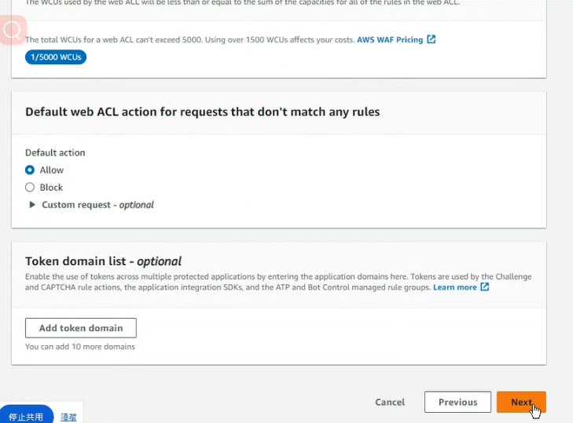
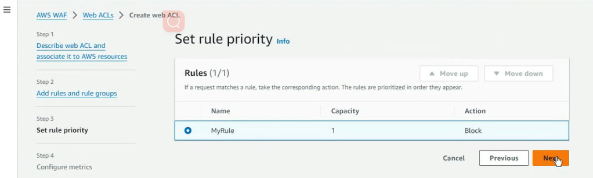

一月二號是期末考

上禮拜我們的s3是開放出來的，不一定要使用cloudfront來進行連接，但是現在http(s3)已經不太安全，所以不希望客戶去直接訪問s3而是透過間接訪問的放式

創造一個新的bucket


名稱看你自己的喜好來取


> Block public

接著創造一個Bucket。 

我們想要放一些網頁上去。好，那就讓我們放一些HTML到這個Bucket裡面。 


創造好之後，就把這個html檔案上傳到我們的S3上。


接著來到cloudFront的部分，我們首先想要先創建一個cloudfront。


S3是我們的。資料來源，那這個這裡的origin，就是要選擇我們的資料來源，但由於我們答案放在S3裡面，所以就選擇剛剛所創建的那個S3。 


這邊要注意的是，我們必須要勾選這個origin access control。 



接著下去create一個ctrl setting。


有時候可能會有名詞重複的問題，那么你就把後面的那些字符串給它刪掉，這是包有一些重要的特徵就可以了。接著我們點擊create。


這段話的意思是說，他等一下會幫我們生成一個S3的policy，那么我們只需要把這段生成的policy貼到我們S3當中就可以。


接著設定我們的default object，呃，讓它變成index HTML。告訴她要從這個檔案來讀取。



其他的地方就不用去做更改，那接下來我們就點擊create。這個項目就可以了。 


可以看到，他已經幫我們生成了policy，那接下來我們就Kobe這個policy把它貼到S3當中就可以了。 

好的，那接下來就回到我們的S3。 


接著點進去，可以看到我們這個頁面。 


接著要點的是permission。 


可以看到permission的選項當中有一個。 Bucket policy。讓我們去進行編輯。 


把剛剛copy的內容貼上去。 


這一段policy的內容，大概就是。讓S3可以接受我們的cloudforms去拿取它裡面。 HTML的內容。

接下來我們保存我們的變更。


接著就可以回到我們的cloudFront來到distribution的部分，大家可以看他是不是真正的去部署完畢，如果部署完畢，我們就可以進行下一個階段的操作。 


這是我們的架構圖，大概的意思就是說客戶端不能夠直接去連接到S上，而是要透過cloud的方式去進行連接。 

透過這種方式，我們可以直接的去保護我們的S3，讓裡面的資料。不背？公開展示。透過Cloud Front去連接到我們想要展示的部分。 


> OriginDomain+index.html 貼到瀏覽器上 就會顯示
> 


# 貼一張 cloudfront成功連接以及s3不能連接的圖


客戶端透過CF 連到S3

# 貼一張以下的圖


期末要考的內容


> 這一張圖想要表明的就是client端不能夠直接去讀取到S3也就是web的內容，而是透過cloudFront。去進行連接要注意的是，我們在課程當中所使用的是HTTP協定，但是在考試的時候，我們所想要使用的是https的協定。如果有空的話，同學們可以。進行練習。 




希望能使用https去連線

等一下要做新的主題但是這個範例還會用請不要先刪除

我們架站使用了兩種方式，第一種是EC2第二種是S3，我們可以使用cloud連接到s3這樣就可以實現邊緣運算

當然cloudFront也可以連接到ALB(Loadbalancer or API Gateway)關於詳情可以至關訪網站查詢，這讓我們了解到架設網站的時候你可以在最前面放上cloudfront，再連接網站儲存體，但是cloudfront前面可不可以放上其他的組件呢??是可以的，你可以放WAF(web application firewalled)，甚至可以在WAF前面放上WEB ACL來進行存取的操作，有了這些我們就可以去判別惡意攻擊或是封鎖特定的ip，這個waf基本上會有兩種類型的動作，一終究是根據我們設定的RULES允許或是拒絕，另一種動作就是去做計算，因為HACKER在座攻擊的時候有可能會使用相同的ip來進行多次的連線，如果同一個ip在一定的時間連線次數過多我們就把它判定為惡意攻擊，並且封鎖ip。

這裡面有些東西是需要付費的，例如RULES，有些東西事由AWS提供，有些則是由其他廠商所提供的，因此屬於商業性質，就...付費吧。


讓我們來更加了解waf吧，我們現在想要讓我們這台電腦的IP不能夠連接上特定的網站。
> https://myip.com.tw/


我們可以查詢目前連接到網際網路的IP是多少，我們假設IP位置是惡意的IP地址，想要對她進行封鎖





> 在這邊，我們選擇Aws的CloudFront。這個選項。


> 接著我們幫它取一個名字。 


> 此圖表明了，如果你想要使用邊緣運算的話，那麼Aws的Cloud Foundry是你一個最佳的選擇，你可以把你的ec2或者是說S3去連接到你的。 Cnoise，那這樣就可以實現邊緣運算，他會找到你最近的伺服器去進行連接。這樣就可以提升它的運算速度。但如果你不想要使用這個功能的話，那么你大可不必設定cloud font。你可以直接使用ALB就是load balance的這個功能來實現你的網站部署。


我們打算把他放在waf前面，但他不一定要放在waf前面，


> 如果不想要使用cloud飯的話，那我們大可不必加入其他的選項，但是如果我們想要使用cloud方的話，那我們就必須要點選這個按鈕，也就是add aws Resource。 


> 選擇你剛剛去部署的這個cloudfront。接著點，確定按鈕。


> 按下next之後，我們可以看到這個頁面這個頁面可以讓你去新增規則，那么新建的規則有兩種，一種是別人已經幫你建立好的，另外一種就是你自己去制定的規則，那么這里的話，老師是先點進去，別人建立好的規則，也就是第一個選項。 


> 點進去的頁面大概是這個樣子。 裡面大概就是Elvis，或者是說其他的防火牆廠商所提供的規則。那么我們先來看看AWS到底提供了什麼樣的規則？


> 我們先來解釋一下選項的部分納入這個選項是。可以讓你的website去防止。你的客戶端使用假賬號，它可以自動的檢測，所以如果你把右邊的這個按鈕點雞。以下之後，那他出現了藍色的。圖示的話，那就代表你已經開啟了這個選項。但是如果你要開啟的話，你必須要清楚，你要明白有些選項它是需要付費的，所以你在。你必須要非常注意他的description的這個選項當中是不是有付費的描述，如果有的話就。視情況而定，看你需不需要？ 


> 你可以看到有capacity的欄位，哪這個就是你可以使用這個功能的上線，但是這個上限它並不是硬性的規定，而是如果你能夠支付更多的費用，就可以獲取更多的上限。 


> 下面的這些選項，他是免費的。


> 我們想要使用的功能就是。阿嬤中IP reputation list。那reputation就是名聲，也就是看誰的名聲比較糟的話，那么我們的網站就不讓他。請到我。的資源當中，他不能獲取我們的資源，就是我們會封鎖他的意思。


> 不好的名聲我們就拒絕他


> 但我們暫不使用


我們並不去使用別人。已經制定好的規則，而是我們現在想要自己去定義一個規則，所以就點擊下方的這個按鈕。 


我們要使用的IP sets


如果已經存在IP Sets的話，老師這邊是把它刪除掉


接著我們新增一個IP Sets


> 設定好IP sets的名稱，並選擇cloudFront(Global)
> IP 的位置是剛剛查詢到的位置
> > 有時候 會沒有global的選項，要等一下


> /32的意思是只有一個IP位置


> 接著建立我們的IP sets


> 做完之後就會出現我們到IP set

回到剛剛創造我們個人設定rules的那個頁面


> 選擇IP Sets


> 這張圖的意思是說，只要它符合IP set的來源的IP，那么我們就把這個IP封鎖掉。 

- Allow: 放行
- Block: 封鎖或拒絕
- Count: 符合規則就 +1, 達到上限就拒絕
- Captcha: 會有google認證類似的東西，防止機器人
  


> 我們所使用的功能，它的capability是以。那么我他總共提供給我們的額度是5000，所以現在他告訴我們，我們總共使用了。五千分之一的額度。


> 這個欄位是要讓我們設定。是否進入的預設值？如果我們選擇allowed，他就會讓其他的規則。變成是允許的，但是我們剛剛所制定的那個規則會依照我們的設定而進行。 







> 一旦開啟了webAcl之後，我們再重新載入cloudFront的這個頁面，那么他就會拒絕讓我們進入。


> 你可以把Cloud Foundry的網址傳送到你telegram的群組自己的群組，那么在使用手機把這個網址點開來。理論上應該是可以進去的，因為它只有封鎖你電腦的IP位置。 


> 如果你想要去刪除這個ACL的話，那么你要先把跟這個SN關聯的resource。去dispatch掉。 


> 再回到這個位置去把我們的SN刪除。那剛剛的畫面視點機。藍色的姓名，也就是my web ACL的部分，就可以進入到剛剛的畫面。

Ip sets，我們也可以把它刪掉。 


接下來我們要設定的是，如果在一段時間內。存取的量。或者是說用戶太多的話，我們要怎麼樣把？他們。給擋在外面就是給一部分的用戶使用。超過的話，就阻擋。


> 新增一個Aws 的 resource。 

接著按下橘色的按鈕到下一個頁面。 


> 增加自訂的規則。 


> 這次我們選擇Rule builder。


> 給它一個名稱。 


> 選擇rate base rule。 


> 輸入框輸入你5分鐘之內，你允許它存儲幾次，我們這裡輸入100，也就是說，如果有一個IP位址超過了100次，那在5分鐘之內我們就會阻擋這個IP位址進行訪問我們的網站。 


按一下add rules。 


> 可以看到我們這樣子的運算量是二。 

接著繼續按下next到達這個頁面。 


> 大概就是說明他會創造一個cloudwatch去監控我們網站的瀏覽次數。那我們這邊幫它取一個名字。 

接著按下next。 


沒有問題的話就可以create ACL。 

那接下來我們就可以選擇使用shell腳本，或者是說Python腳本去。創造一個能夠連續。進入到這個網站的程式。讓我們的進入次數超過了上限，那他應該就會顯示。阻擋我們的訪問。 

先開啟一臺虛擬機，並且到Aws的導航欄裡面去搜索cloudwatch哪。可以看到crowd watch的navigation bar裡面有一個log。
(喔不是是my web ACL裡面有一個月。就是你到你的剛剛創建的那個ACL裡面點進去，大家就會看到有一個cloudwatch logs。 ) 


> 下面的圖才是正確的。 


> Wf這邊有一個sample Requests，那你就點進去。

我們打開剛剛的網頁。並且呢，重新整理。 (你可以按下F5。)


> 到sample request這邊去進行重新整理，應該也可以看到剛剛的一些資訊。可以看到納哥我們進入到那個網站的資訊。 

接下來我們就要來驗證他是不是會真正的去防止的DDOS的攻擊，那我們就回到虛擬機當中去開啟。一個文件來編輯我們的腳本。 


> 老師這邊使用的是Shell。 

```sh
for i in {1..110}
do
  echo $i
  result=curl -o /dev/null -s -w %{http_code} https://d36xl9iuaw2xue.cloudfront.net/ # <--你自己的網址
  if [[ "$result" == "200" ]] ; then
    # 200 -> success
    echo "ok"
    
  else
    echo "fail"
  fi
done
```

寫好這個腳本之後，把它儲存起來，然後。到我們的cloudfront。的網頁把它的網址複製起來，我們需要它的網址。 

你可以使用python來寫

```py
import requests

for i in range(1, 111):
  print(i)
  response = requests.get("https://d36xl9iuaw2xue.cloudfront.net/")
  if response.status_code == 200:
    print("ok")
  else:
    print("fail")

```

`sudo apt install python3-requests`


> 腳本畫線的部分沙進行更改，更改成你自己的網址。 


> 給這個腳本執行的權限

```sh
chmod +x # name.sh or py
```

如果你使用的是python
```sh
python3 name.py #name是你的檔案名稱
```


有可能要等一下cloudWatch才會啟用規則

再執行一次


> 可以看到已經變成fail了


> 主機端也進不去這個網站了


# 抓一下存取太多次被BLOCK的圖片

WAF可以使用正則表達式


>你可以像很多條規則，然後根據party來。決定他的執行順序，如果。已經沒有處理事項呢，他會根據Default的設定。來處理事情。

把ACL, cloudFront, IP sets 刪除

Relational Database: 狀態很嚴謹，完成或不完成(銀行)，沒有完成不能亂存或扣錢

但是有的時候我們並不關注。他的狀態完不完成，我們只是想要。整個資料庫能夠提升他自己的速度。 

Everything提供了這種nosql的服務，那麼他的服務名稱叫做**dynamo DB**。


與傳統資料庫的不同。 No SQL。這種服務，他只有表格，他沒有資料庫一般的傳統資料庫，你需要。先創建加固在創建表格，但是在noSQL的話，我們只要創建表格就可以。 


>  給它一個名稱。 


> 設定KEY

其他的東西不需要做更改。 


> 接著創建表格。 


> 接者來到eXPLORE ITEMS 點擊 ADDRBOOK -> Create item


> 可以增加新的欄位 是String不是StringSet

新增String欄位


Create item


我們還可以繼續增加


> 增加性別

非關係型資料庫的特點就是你的欄位不一定每個都要填寫，你可以自己去做選擇。那傳統的資料庫裡，每個欄位都要有數值。 

增加peter


# 做完之後貼一張圖

由於老師已經忘了燙的。帳號密碼，所以我們就再重新創一個使用者，所以先來到IAM這邊。 

刪除Tom之後再創建一個。


> 設定密碼


設定權限


創建使用者

我們需要他的accessKey
跟secret Key


> create acess key


先開啟虛擬機(需要安裝AWS 的 CLI)


> 使用aws configure


> 配置access Key 跟 secretKey


> 寫一個腳本


```py
import boto3
import os
os.environ['AWS_DEFAULT_REGION'] = 'us-east-1'


_TableName_ = "addrbook"

client = boto3.client('dynamodb')

DB = boto3.resource('dynamodb')
table = DB.Table(_TableName_)

response = table.get_item(
    Key={
        'name': "mary"
    }
)
response["Item"]

print(response['Item'])

```


>  跟資料表格的名稱要是一樣的


如果想存取Tom


# 抓一張圖

我們會使用到accesskey 跟 secretkey


> 有一個.aws的隱藏目錄可以看到妳的密碼

## Lambda function: For serverLess Computing

users forcus on code

- Start EC2 using code

- or other aws services

aws Lambda與chatgpt的應用


產生Roles


> DynamoDB


> Lambda


Next


Create Role


Create


> 可以使用aws 來製作app的API進而接收或儲存或CRUD 整個系統


