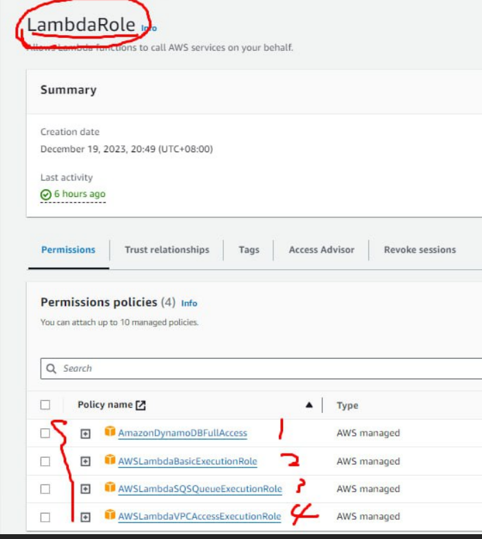
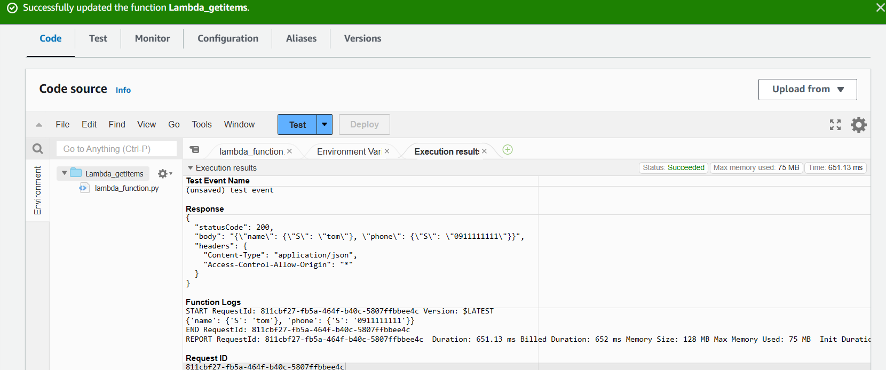
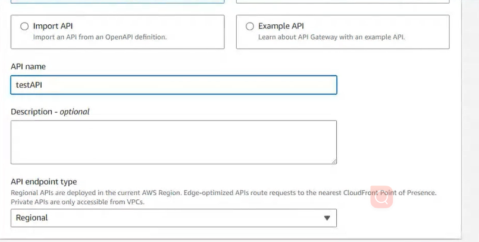
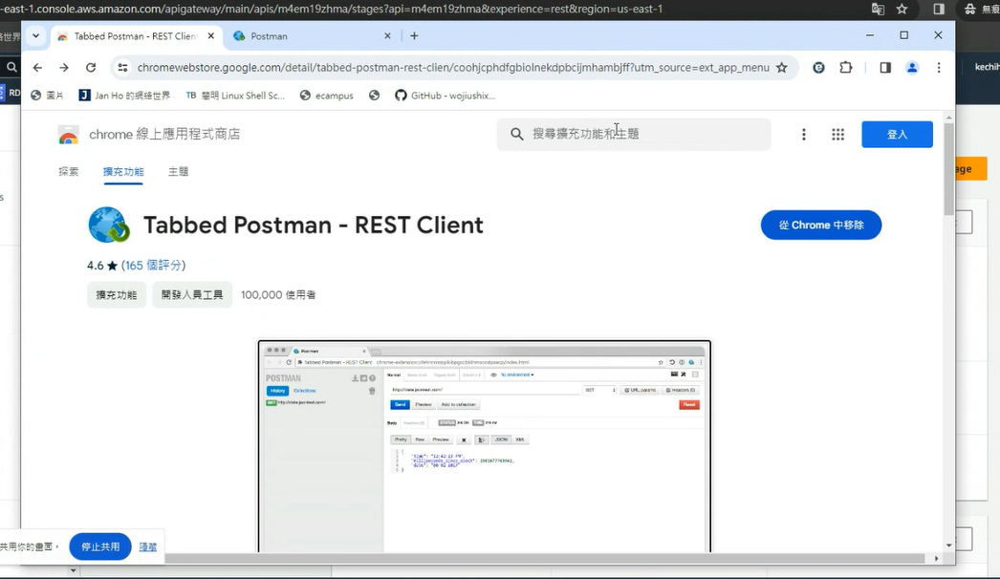

上完課之後要去看billing是否有被收費，被收費代表你有些東西沒有關閉


老師被扣了1.多美金

http 提供了很多的方法，get很實用可以去獲取資料，post則可以上傳文章

今天要說的是Lambda

我們上個禮拜使用了Lambda role

我們需要新增Role

- 添加使用者權限
- 建立lambda Function

- 建立lambda Function讀取DynamoDB 跟寫入DynamoDB

- 


`傳統來說你的虛擬機需要一臺一臺去配置,加設定一些網路它的結構還有很多東西 
，所以AWS提供了Lambda function讓你可以直接設定好代碼當達成事件的時候就自動觸發代碼`





click test


```py
import json
import boto3

client = boto3.client('dynamodb')

def lambda_handler(event, context):
  data = client.get_item(
    TableName='addrbook',
    Key={
        'name': {
          'S': 'tom'
        }
    }
  )
  print(data['Item'])
  response = {
      'statusCode': 200,
      'body': json.dumps(data['Item']),
      'headers': {
        'Content-Type': 'application/json',
        'Access-Control-Allow-Origin': '*'
      },
  }
  return response
```


# 圖1



> 按下test


change to mary


## 讀取資料截一張圖

Create new Lambda function


copy


paste

```py
import json
import boto3
client = boto3.client('dynamodb')
def lambda_handler(event, context):
    PutItem = client.put_item(
        TableName='addrbook',
        Item={
            'name': {
              'S': 'john'
            },
            'phone': {
              'S': '0931987654'
            }
        }
      )
    response = {
      'statusCode': 200,
      'body': json.dumps(PutItem)
    }
    return response
```


deploy


test


save

click test


## 抓一張寫入john


Stracture


## 使用APIgetway連接lamda根據使用者調用API進行相對應操作

- 建立lambdaFunction (用於連接DynamoDB並顯示資料庫內容)

- 到API Gateway創建restAPI 建立資源配置路徑
- 關連 restAPI 與 lambda function
- 進行測試獲取資料


```py
import json
import boto3
import logging

logger = logging.getLogger()
logger.setLevel(logging.INFO)

dynamodb = boto3.resource('dynamodb',region_name='us-east-1')

def lambda_handler(event, context):
  print(event)
  data = {
    'Items' : "Bad Request"
  }
  statusCode = 200
  path = event["path"]
  httpMethod = event["httpMethod"]
  table = dynamodb.Table('addrbook')
  if httpMethod == 'GET' and path == '/addrbook':
    data = table.scan()
  elif httpMethod == 'POST' and path == '/add_addrbook':
    if event['body'] is not None :
      body = json.loads(event['body'])

      table.put_item(
        Item={
          'name': body['name'],
          'phone': body['phone']
        },
      )

      data = {
        'Items' : "addrbook created statusCodeuccessfully"
      }
    else:
      data = {
        'Items' : "Invalid Payload"
      }
      statusCode = 400
  else:
    statusCode = 400

  print(data['Items'])
  response = {
    'statusCode': statusCode,
    'body': json.dumps(data['Items']),
    'headers': {
       'Content-Type': 'application/json',
    },
  }

  return response
```


> deploy


Choice rest api build





> create resource


Create


# 先做到這裡


先開一台linux的虛擬機


Deploy

# 部屬RestAPI

- Deploy API
- using chrome postman tool
- copy api url paste to postman tool and add /addrbook like `......./addrbook`





> plus /addrbook


after deploy


# 貼一張圖


## Terraform

- DownLoad terraform for your linux
- In linux create tf file
- main.tf and variables.tf
- variable tf include your variable for main.tf
- change vairable ami content(if in us-east-1 using it!) you can in ec2 ami catalog to find ami content
- `terraform init` to initialize your file directory
- `terraform plan` like git add (you can preveiew what you add)
- `terraform apply` to push to aws
- `terraform destroy` to delete all terraform control (delete what you add this is help us easy to use aws)


DownLoad


crtl C & V


need install aws cli first


main.tf and variables.tf copy paste from file

```TF
provider "aws" {
  region = var.region
}

resource "aws_instance" "mytest_vm" {
  ami = lookup(var.amis, var.region)
  instance_type=var.instance_type
  
  tags = {
   # Name = "mytest",
 }
}


```


> ami要改

```tf
variable "region" {
    type = string
    default = "us-east-1"
    description="aws region"
}

variable "amis" {
    type=map
    default = {
        us-east-1 = "ami-06b09bfacae1453cb"
    }
    description = "ami id"

}

variable "instance_type" {
    type=string
    default = "t2.micro"
    description = "EC2 instance type"
}


```


> ami source


## change (cache)


> change


> No change

## Push to aws


start create


## success


我遲遲不能夠成功直到我去刪除aws的default vpc再重新創建


## 貼一張圖


## Terraform 可以讓aws變得比較好去管理與維護

tf檔沒有寫的東西就會使用預設值


> 可以創造多個虛擬機


## destroy


> 可以一鍵刪除你剛剛配置的東西不用一個一個去刪除

## 貼一下Destroy


## 創建vpc跟subnet

開啟test1 資料夾當中有tf檔案，把裡面的內容增加到Linux tf當中.


```tf
provider "aws" {
  region = var.region
}

resource "aws_vpc" "testvpc"{
    cidr_block="192.168.0.0/16"
    tags = {
        Name = "testvpc"
    }
}

resource "aws_subnet" "testvpc-web" {
    vpc_id = "${aws_vpc.testvpc.id}"
    cidr_block = "192.168.1.0/24"
    tags = {
        Name = "testvpc-web"
    }
}
```

testvpc1


> subnet 要寫 vpc_id 使用$()獲取 vpc 的id


 `terraform apply`


## 抓一下testvpc 跟 subnet 最後 destroy


```sh
terraform destroy
```


