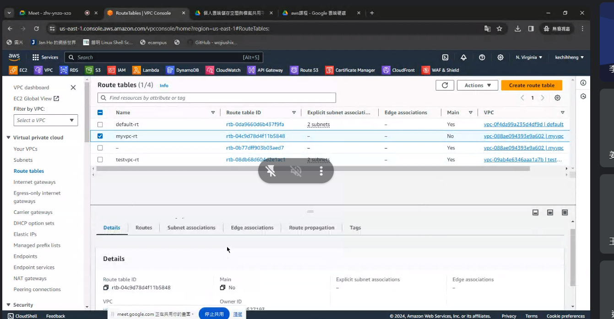
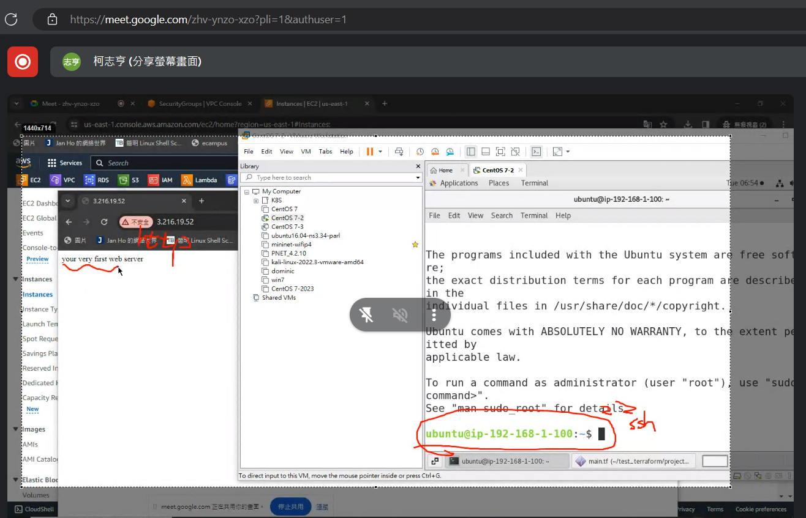

產生兩個ec2 跟一個alb讓client可以連接到我們的server可以輪巡


main.tf


paste


vpc ex


12m free

spot instance
被閒置的資源提供給消費者

low price get instance


can setting maxima price for buy instance if over this value stop spot service


data center 

```tf
provider "aws" {
  region = "us-east-1"
}

resource "aws_vpc" "myvpc"{
    cidr_block="192.168.0.0/16"
    tags = {
        Name = "myvpc"
    }
}
```


init


## paste create a new vpc

create subnet

```tf
resource "aws_subnet" "testvpc-web" { # testvpc 可以改成你的vpc名稱
    vpc_id = "${aws_vpc.testvpc.id}" # testvpc要改成你的vpc名稱
    cidr_block = "192.168.1.0/24"
    availability_zone = "us-east-1a"
    tags = {
        Name = "testvpc-web"
    }
}
```

add to main.tf


save and `apply`

這次只會建立subnet 已建立的就不會再重新建立了，不重覆創造資源


# create a new subnet and paste to telegram

put a internet GateWay


```tf

resource "aws_internet_gateway" "igw" {
    vpc_id="${aws_vpc.myvpc.id}"
    tags = {
        Name = "myvpcvpc-igw"
    }
}
```


# paste create internet gateway


add route table


apply





client連接伺服器往igw 送

# 貼一張創建出routetable的圖

```tf

resource "aws_route_table" "myrt" {
    vpc_id="${aws_vpc.myvpc.id}"

    route {
        cidr_block="0.0.0.0/0"
        gateway_id = "${aws_internet_gateway.igw.id}"
    }

    tags = {
        Name = "myvpc-rt"
    }
}
```


bind network and route table

association

```tf
resource "aws_route_table_association" "myrt_assoc" {
    subnet_id = aws_subnet.myvpc-web.id
    route_table_id = aws_route_table.myrt.id
}
```


subnet connect route table

# paste a picture show subnet bind route table

security group

change code to our vpc or another name


ingress -> input
egress => output

```tf
resource "aws_security_group" "sg_myvpc" {
    name = "sg_myvpc"
    description="security group for myvpc"
    vpc_id="${aws_vpc.myvpc.id}"

    ingress {
       description = "HTTPS traffic"
       from_port = 443
       to_port = 443
       protocol ="tcp"
       cidr_blocks = ["0.0.0.0/0"]   
    }

    ingress {
       description = "HTTP traffic"
       from_port = 80
       to_port = 80
       protocol ="tcp"
       cidr_blocks = ["0.0.0.0/0"]   
    }

    ingress {
       description = "SSH traffic"
       from_port = 22
       to_port = 22
       protocol ="tcp"
       cidr_blocks = ["0.0.0.0/0"]   
    }

    egress {
        from_port = 0
        to_port = 0
        protocol ="-1"
        cidr_blocks= ["0.0.0.0/0"]  
    }

    tags = {
        Name = "sg_myvpc"
    }
}
```

we need elastic ip (need pay) to get static ip address


```tf
resource "aws_network_interface" "webserver-nic" {
    subnet_id = aws_subnet.myvpc-web.id
    private_ips=["192.168.1.100"]
    security_groups = ["${aws_security_group.sg_myvpc.id}"]  
}

resource "aws_eip" "web-eip" {
    vpc = true
    network_interface = aws_network_interface.webserver-nic.id
    associate_with_private_ip = "192.168.1.100"
    depends_on = [aws_internet_gateway.igw] 
}
```

# paste create elastic ip

add ec2 to main.tf

we want to change ami soure from ubuntu


paste to your main.tf


```tf
resource "aws_instance" "webserver" {
  ami="ami-0261755bbcb8c4a84"
  instance_type = "t2.micro"
  availability_zone = "us-east-1a"
  key_name = "myAWS"

  network_interface {
    device_index = 0
    network_interface_id = aws_network_interface.webserver-nic.id
  }
  
  user_data = <<-EOF
              #!/bin/bash
              sudo apt update -y
              sudo apt install apache2 -y
              sudo systemctl start apache2
              sudo bash -c 'echo your very first web server > /var/www/html/index.html'
              EOF   
  tags ={
    Name = "web-server"
  }
}

```

rename keyname

Code had sh script

apply and go to instance

you will saw it create a new instance


we can using ssh to connect

we can also using web browser to connect ec2




destroy


# Alb using terraform


> ref:https://plainenglish.io/blog/deploy-a-set-of-ec2-instances-behind-an-alb-using-terraform-403fe584f09e

Before you begin, ensure that you have a virtual private cloud (VPC) with at least one public subnet in each of the zones used by your targets. For more information, see Subnets for your load balancer.

you can also using aws cli for create
Tutorial: [Create an Application Load Balancer using the AWS CLI](https://docs.aws.amazon.com/elasticloadbalancing/latest/application/create-application-load-balancer.html#:~:text=Tutorial%3A%20Create%20an%20Application%20Load%20Balancer%20using%20the%20AWS%20CLI.).


## 創建vpc跟subnet
To create a load balancer using the AWS Management Console, complete the following tasks.

Before you begin

Decide which two Availability Zones you will use for your EC2 instances. Configure your virtual private cloud (VPC) with at least one public subnet in each of these Availability Zones. These public subnets are used to configure the load balancer. You can launch your EC2 instances in other subnets of these Availability Zones instead.

```tf
# Specify the region in which we would want to deploy our stack
variable "region" {
  default = "us-east-1"
}

# Specify 3 availability zones from the region
variable "availability_zones" {
  default = ["us-east-1a", "us-east-1b" ]
}

terraform {
  required_providers {
    aws = {
      source  = "hashicorp/aws"
    }
  }
}

# Configure the AWS Provider
provider "aws" {
  region = var.region
}

# Create a VPC
resource "aws_vpc" "my_vpc" {
  cidr_block = "10.0.0.0/16"

  tags = {
    Name = "my_vpc"
  }
}

# Create a subnet in each availability zone in the VPC. Keep in mind that at this point these subnets are private without internet access. They would need other networking resources for making them accesible

resource "aws_subnet" "my_subnet" {
  count             = length(var.availability_zones)
  vpc_id            = aws_vpc.my_vpc.id
  cidr_block        = cidrsubnet("10.0.0.0/16", 8, count.index)
  availability_zone = var.availability_zones[count.index]

  tags = {
    Name = "my-subnet-${count.index}"
  }
}

# Put an instance in each subnet
resource "aws_instance" "webInstance" {
  count         = length(var.availability_zones)
  ami           = ami-079db87dc4c10ac91
  instance_type = "t2.micro"
  subnet_id     = aws_subnet.my_subnet[count.index].id
  vpc_security_group_ids = [aws_security_group.sg_my_vpc.id]

  tags = {
    Name = "my-instance-${count.index}"
  }
}
```


Launch at least one EC2 instance in each Availability Zone. Be sure to install a web server, such as Apache or Internet Information Services (IIS), on each EC2 instance. Ensure that the security groups for these instances allow HTTP access on port 80.
## (建立安全通道，規範可行路線)

```tf
resource "aws_security_group" "sg_my_vpc" {
    name = "sg_myvpc"
    description="security group for my_vpc"
    vpc_id="${aws_vpc.my_vpc.id}"

    ingress {
       description = "HTTPS traffic"
       from_port = 443
       to_port = 443
       protocol ="tcp"
       cidr_blocks = ["0.0.0.0/0"]   
    }

    ingress {
       description = "HTTP traffic"
       from_port = 80
       to_port = 80
       protocol ="tcp"
       cidr_blocks = ["0.0.0.0/0"]   
    }

    ingress {
       description = "SSH traffic"
       from_port = 22
       to_port = 22
       protocol ="tcp"
       cidr_blocks = ["0.0.0.0/0"]   
    }

    egress {
        from_port = 0
        to_port = 0
        protocol ="-1"
        cidr_blocks= ["0.0.0.0/0"]  
    }

    tags = {
        Name = "sg_my_vpc"
    }
}
```

## 建立internet gateway連接外網
```tf
resource "aws_internet_gateway" "igw" {
    vpc_id="${aws_vpc.my_vpc.id}"
    tags = {
        Name = "my_vpc-igw"
    }
}
```

建立路由表 連接igw
```tf
resource "aws_route_table" "myrt" {
    vpc_id="${aws_vpc.my_vpc.id}"

    route {
        cidr_block="0.0.0.0/0"
        gateway_id = "${aws_internet_gateway.igw.id}"
    }

    tags = {
        Name = "my_vpc-rt"
    }
}
```


Tasks
- Step 1: Step 1: create Ec2(Instance) according vpc and configure subnet

- Step 2: create loadbalancer and lisener

- Step 3: Test the load balancer

Absolute, you can follow this step flow to create your terraform file


### Step 1: create Ec2(Instance) according vpc and configure subnet

```tf
# 在每個子網中創建一個 EC2 實例
resource "aws_instance" "webInstance" {
  count = length(var.availability_zones)  # 創建與可用區數量相同的實例
  disable_api_termination = true

  ami           = "ami-079db87dc4c10ac91"  # 指定 AMI(我使用centos)
  instance_type = "t2.micro"  # 指定實例類型
  subnet_id     = aws_subnet.my_subnet[count.index].id  # 關聯到子網
  vpc_security_group_ids = [aws_security_group.sg_my_vpc.id]
  key_name = "myAws" # 密鑰.pem檔放在專案根目錄
  associate_public_ip_address = true # 為了測試是否可以連接ec2而開啟，使用loadbalancer時應該關掉，不然會有多個路口，安全疑慮
  user_data 	= file("httpd.sh") # 你可以使用 >>EOF 但太容易出錯所以我改成這樣


  tags = {
    Name = "my-instance-${count.index}"  # 標記實例名稱
  }
}
```
(這是給centos用的代碼) 放在專案根目錄
httpd.sh內容:
```sh
#!/bin/bash
yum update -y
yum install httpd -y
service httpd start
chkconfig httpd on
# cd /var/www/html
echo "Hello World from $(hostname -f) from avaliability zone: $REGION_AV_ZONE" > /var/www/html/index.html
```

### Step2: create loadbalancer and lisener

```tf
resource "aws_lb_target_group" "alb-myweb-tg" {
  # 目標組的名稱
  name   = "alb-myweb-tg"

  # 目標組監聽的端口
  port   = 80

  # 目標組監聽的協議
  protocol = "HTTP"

  # 目標組所屬的 VPC
  vpc_id = aws_vpc.my_vpc.id
}


resource "aws_lb_target_group_attachment" "alb-myweb-attachment" {
  # 創建與 EC2 實例數量相同的附加
  count = length(aws_instance.webInstance)

  # 目標組的 ARN
  target_group_arn = aws_lb_target_group.alb-myweb-tg.arn

  # 要附加到目標組的 EC2 實例的 ID
  target_id = aws_instance.webInstance[count.index].id

  # 附加的端口
  port = 80
}

resource "aws_lb" "my_lb" {
  # 負載均衡器的名稱
  name = "my-lb-tf"

  # 是否為內部負載均衡器 (false 表示面向公眾的負載均衡器)
  internal = false

  # 負載均衡器的類型 (application 表示應用程式負載均衡器)
  load_balancer_type = "application"

  # 關聯的安全組
  security_groups = [aws_security_group.sg_my_vpc.id]

  # 負載均衡器所在的子網
  subnets = [for subnet in aws_subnet.my_subnet : subnet.id]

  # 是否啟用刪除保護
  enable_deletion_protection = false

  # 標記
  tags = {
    Environment = "front"
  }
}


resource "aws_lb_listener" "alb-myweb-listener" {
  # 負載均衡器的 ARN
  load_balancer_arn = aws_lb.my_lb.arn

  # 監聽的端口
  port = 80

  # 監聽的協議
  protocol = "HTTP"

  # 默認操作 (將請求轉發到目標組)
  default_action {
    type = "forward"
    target_group_arn = aws_lb_target_group.alb-myweb-tg.arn
  }
}


```


### Step3: Test
`terraform apply`

### Step4: Destroy
`terraform destroy`


## Final Code:
```tf
# 指定要部署資源的區域
variable "region" {
  default = "us-east-1"  # 默認使用 us-east-1 區域
}

# 指定要使用的可用區
variable "availability_zones" {
  default = ["us-east-1a", "us-east-1b"]  # 默認使用兩個可用區
}

terraform {
  required_providers {
    aws = {
      source = "hashicorp/aws"  # 指定 AWS 供應商
    }
  }
}

# 配置 AWS 供應商
provider "aws" {
  region = var.region  # 使用指定的區域
}

# 創建 VPC
resource "aws_vpc" "my_vpc" {
  cidr_block = "10.0.0.0/16"  # 指定 VPC 的 CIDR 塊

  tags = {
    Name = "my_vpc"  # 標記 VPC 名稱
  }
}

# 在每個可用區創建一個子網
resource "aws_subnet" "my_subnet" {
  count = length(var.availability_zones)  # 創建與可用區數量相同的子網

  vpc_id     = aws_vpc.my_vpc.id  # 關聯到 VPC
  cidr_block = cidrsubnet("10.0.0.0/16", 8, count.index)  # 計算子網的 CIDR 塊
  availability_zone = var.availability_zones[count.index]  # 指定子網的可用區

  tags = {
    Name = "my-subnet-${count.index}"  # 標記子網名稱
  }
}


resource "aws_internet_gateway" "igw" {
    vpc_id="${aws_vpc.my_vpc.id}"
    tags = {
        Name = "my_vpc-igw"
    }
}

resource "aws_route_table" "myrt" {
    vpc_id="${aws_vpc.my_vpc.id}"

    route {
        cidr_block="0.0.0.0/0"
        gateway_id = "${aws_internet_gateway.igw.id}"
    }

    tags = {
        Name = "my_vpc-rt"
    }
}

resource "aws_route_table_association" "myrt_assoc" {
    count = length(var.availability_zones)

    subnet_id      = aws_subnet.my_subnet[count.index].id
    route_table_id = aws_route_table.myrt.id
}

# 
resource "aws_security_group" "sg_my_vpc" {
    name = "sg_my_vpc"
    description="security group for my_vpc"
    vpc_id="${aws_vpc.my_vpc.id}"

    ingress {
       description = "HTTPS traffic"
       from_port = 443
       to_port = 443
       protocol ="tcp"
       cidr_blocks = ["0.0.0.0/0"]   
    }

    ingress {
       description = "HTTP traffic"
       from_port = 80
       to_port = 80
       protocol ="tcp"
       cidr_blocks = ["0.0.0.0/0"]   
    }

    ingress {
       description = "SSH traffic"
       from_port = 22
       to_port = 22
       protocol ="tcp"
       cidr_blocks = ["0.0.0.0/0"]   
    }

    egress {
        from_port = 0
        to_port = 0
        protocol ="-1"
        cidr_blocks= ["0.0.0.0/0"]  
    }

    tags = {
        Name = "sg_my_vpc"
    }
}


# 在每個子網中創建一個 EC2 實例
resource "aws_instance" "webInstance" {
  count = length(var.availability_zones)  # 創建與可用區數量相同的實例
  disable_api_termination = true

  ami           = "ami-079db87dc4c10ac91"  # 指定 AMI
  instance_type = "t2.micro"  # 指定實例類型
  subnet_id     = aws_subnet.my_subnet[count.index].id  # 關聯到子網
  vpc_security_group_ids = [aws_security_group.sg_my_vpc.id]
  key_name = "myAws"
  associate_public_ip_address = true
  user_data 	= file("httpd.sh")


  tags = {
    Name = "my-instance-${count.index}"  # 標記實例名稱
  }
}


resource "aws_lb_target_group" "alb-myweb-tg" {
  name        = "alb-myweb-tg"
  port        = 80
  protocol    = "HTTP"
  vpc_id      = aws_vpc.my_vpc.id
}


resource "aws_lb_target_group_attachment" "alb-myweb-attachment" {
  count = length(aws_instance.webInstance)
  target_group_arn = aws_lb_target_group.alb-myweb-tg.arn
  target_id = aws_instance.webInstance[count.index].id
  port = 80
}

resource "aws_lb" "my_lb" {
  name               = "my-lb-tf"
  internal           = false
  load_balancer_type = "application"
  security_groups    = [aws_security_group.sg_my_vpc.id]
  subnets            = [for subnet in aws_subnet.my_subnet : subnet.id]

  enable_deletion_protection = false


  tags = {
    Environment = "front"
  }
}

resource "aws_lb_listener" "alb-myweb-listener" {
 load_balancer_arn = aws_lb.my_lb.arn
 port = 80
 protocol = "HTTP"

 default_action {
  type = "forward"
  target_group_arn = aws_lb_target_group.alb-myweb-tg.arn
 }
 
 
}

```


